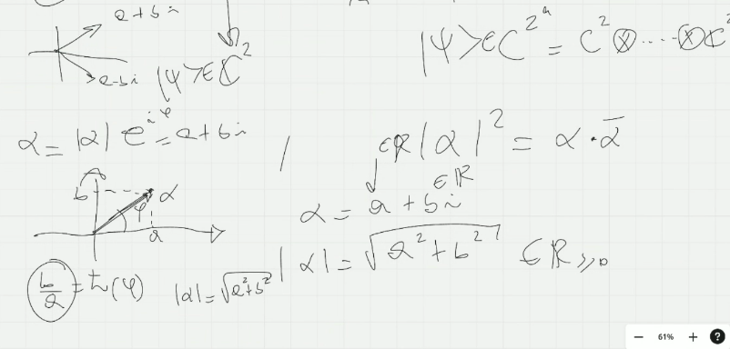
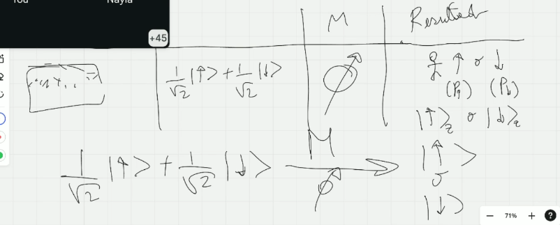
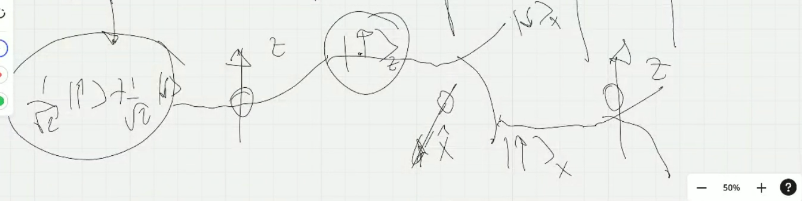
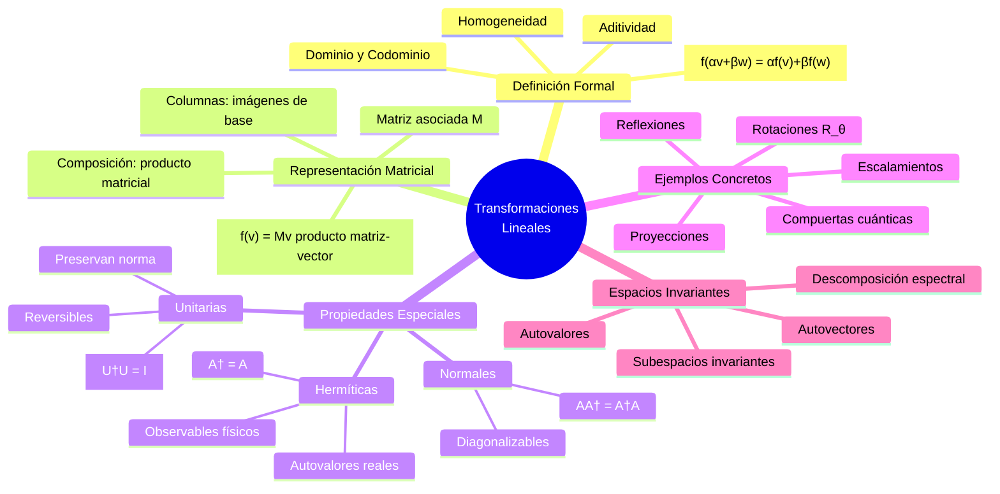
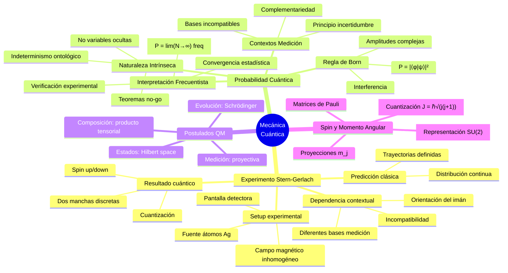
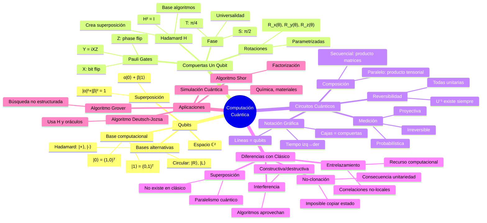

# Clase 3: Transformaciones Lineales, Compuertas Cuánticas y el Experimento de Stern-Gerlach

**Fecha:** Martes 5 de noviembre de 2024  
**Docente:** Dr. Federico Holik  
**Curso:** Introducción a la Computación Cuántica 2025

**Clase anterior:** [[ICC25-Holik-Clase2-Resumen|Clase 2 - Formalismo Cuántico y Álgebra Lineal]]  
**Clase siguiente:** Clase 4 - Producto Interno y Notación de Dirac

---

## Resumen Ejecutivo

La tercera clase marca un punto de inflexión en el curso, estableciendo el puente entre el formalismo matemático abstracto desarrollado en las clases anteriores y las aplicaciones concretas en computación cuántica. El eje central de la sesión fue comprender cómo las transformaciones lineales operan sobre espacios vectoriales complejos y cómo estas se materializan en compuertas lógicas cuánticas.

El docente utilizó el experimento de Stern-Gerlach como ejemplo arquetípico para ilustrar la naturaleza probabilística de la mecánica cuántica y el concepto de qubit físico. Este experimento histórico demuestra que magnitudes físicas como el momento magnético del electrón (spin) están cuantizadas, pudiendo tomar únicamente dos valores discretos en cualquier dirección de medición. Esta discretización es el análogo físico del bit cuántico (qubit).

Se profundizó en la interpretación frecuentista de la probabilidad, esencial para comprender cómo se contrastan experimentalmente las predicciones de la teoría cuántica. A diferencia de la probabilidad clásica, que surge de la ignorancia sobre variables ocultas, la probabilidad cuántica es intrínseca a la naturaleza: el sistema genuinamente no posee valores definidos antes de la medición.

El concepto central de la clase fue el de **transformación lineal**, formalizado como un mapeo entre espacios vectoriales que preserva la estructura lineal. Se demostró que toda transformación lineal puede representarse matricialmente y que, conversely, toda matriz define una transformación lineal mediante el producto matriz-vector. Esta correspondencia biunívoca es fundamental porque las compuertas cuánticas son precisamente transformaciones lineales unitarias actuando sobre el espacio de estados de los qubits.

Se introdujeron las primeras compuertas cuánticas: la compuerta de Hadamard (H) y la compuerta NOT cuántica (X, también llamada Pauli-X). La compuerta H es especialmente relevante porque genera superposiciones balanceadas de los estados base |0⟩ y |1⟩, siendo un elemento fundamental en la mayoría de los algoritmos cuánticos. Se demostró que H² = I (la identidad), lo que implica que H es su propia inversa—una propiedad que será crucial en el análisis de circuitos cuánticos.

La clase culminó introduciendo la notación de circuitos cuánticos, donde las líneas horizontales representan qubits y las cajas etiquetadas representan compuertas. Esta notación gráfica será el lenguaje estándar para describir algoritmos cuánticos en el resto del curso.

**Conexión con Clase 2:** Esta clase aplica directamente los conceptos de [[ICC25-Holik-Clase2-Resumen#Espacios Vectoriales|espacios vectoriales]] y [[ICC25-Holik-Clase2-Resumen#Combinaciones Lineales|combinaciones lineales]] desarrollados previamente, dotándolos ahora de significado físico y computacional concreto.

---

## Contenidos Principales

### 1. El Experimento de Stern-Gerlach (1922)

> **Referencia histórica:** Este experimento fue uno de los primeros en demostrar experimentalmente el carácter cuántico de la materia, específicamente la cuantización del momento angular intrínseco (spin).

#### 1.1 Configuración Experimental

**Componentes:**
- **Fuente (O):** Horno que calienta plata generando un vapor atómico
- **Selector de velocidades (S):** Colima el haz atómico
- **Campo magnético inhomogéneo (M):** Imán con geometría especial que produce gradiente de campo
- **Pantalla detectora(D):** Superficie metálica que registra el impacto de átomos
![[stern_esquema.png]]
**Disposición espacial:**
```
[Fuente] → [Selector] → [Imán] → [Pantalla]
   (O)        (S)         (M)       (D)
```

**Principio físico:**
Los átomos de plata tienen un electrón desapareado en la capa externa con momento magnético asociado. Al atravesar un campo magnético no uniforme, experimentan una fuerza proporcional al gradiente del campo y a la componente del momento magnético en la dirección del gradiente.

$$F_z \propto \mu_z \cdot \frac{dB}{dz}$$

donde $μ_z$ es la componente z del momento magnético y dB/dz es el gradiente del campo.

#### 1.2 Predicción Clásica vs. Resultado Cuántico

**Predicción Clásica:**
- El momento magnético puede tener cualquier orientación en el espacio
- El momento magnético toma valores continuos: $μ_z ∈ [-μ_₀, + μ_₀]$
- **Patrón esperado:** Distribución continua en la pantalla (mancha uniforme)

**Resultado Experimental:**
- Se observan **exactamente dos manchas discretas**
- Una mancha corresponde a deflexión "hacia arriba" (↑)
- Otra mancha corresponde a deflexión "hacia abajo" (↓)
- **Interpretación:** El momento magnético (y el spin) está cuantizado
- Solo dos valores posibles: spin up y spin down

**Implicancias fundamentales:**
1. **Cuantización:** Las magnitudes físicas toman valores discretos
2. **Sistema de dos niveles:** Arquetipo del qubit
3. **Dependencia contextual:** Las probabilidades dependen de la orientación del imán
4. **Indeterminismo intrínseco:** No se puede predecir el resultado individual, solo probabilidades

**Referencias bibliográficas:**
- **Nielsen & Chuang:** Discusión en contexto de mediciones (Sec. 2.2.3)
- **Quantum Mechanics and Path Integrals** (Feynman & Hibbs): Capítulo 1
- Material histórico disponible en el IFLP sobre experimentos fundacionales

#### 1.3 Representación Matemática

**Estados base (notación física, de [[_Teoria.d/Algebra#Notación de Dirac|Dirac]])**
- Spin arriba en dirección z: $|↑⟩_z$ o $|up⟩_z$
- Spin abajo en dirección z: $|↓⟩_z$ o $|down⟩_z$

**Estados base (notación computacional):**
- |0⟩ = (1, 0)ᵀ  = $\ket{↑}_z$ — spin arriba (medido con operador  $\sigma_z$)
- |1⟩ = (0, 1)ᵀ  = $\ket{↓}_z$ — spin abajo (medido con operador en $\sigma_z$)

siendo vectores, si le agregamos producto interno, obtenemos un *Espacio de Estados de Hilbert* ℂ² (espacio vectorial complejo de dimensión 2)

>[!tip] para no confundir |0⟩ con |1⟩, recordar las columnas de $\mathbb{I}$:
> $\mathbb{I}=\left[\begin{matrix}1 & 0 \\ 0 & 1\end{matrix}\right]$


El docente repasa (otra vez) números complejos:

>[!note] ver [[_Teoria.d/Algebra#Números Complejos (Escalares del Espacio Vectorial)]]

la referencia al producto tensiorial, viene de otra explicación. Ver  6.3 Composición Paralela (Producto Tensorial)


**Estado general:**
$$|\psi\rangle = \alpha \ket{↑} + \beta \ket{↓} = \begin{pmatrix} \alpha \\ \beta \end{pmatrix}$$

donde α, β ∈ ℂ y |α|² + |β|² = 1 (normalización, ver [[_Teoria/Algebra]]).

Cuando medimos en el eje $\hat{z}$, es decir, con el operador $\sigma_z$:
![[stern_ejez.png]]
Solo obtendremos  $\ket{↑}_z$ o  $\ket{↑}_z$ , a pesar de que el estado en $F$ sea una superposición, $\alpha \ket{↑} + \beta \ket{↓}$. Y los obtendremos con probabilidades P dadas por la Regla de Born: $P(↑) = |{\alpha}|^2$ y  $P(↓)=|\beta|^2$ (recordar q son escalares complejos de un espacio de Hilbert).


#### 1.4 Dependencia Contextual: Rotación del Imán (M)

**Concepto crucial:** Si se rota el imán un ángulo θ respecto a la dirección $\hat{z}$, se usará una nueva base de medición. Las probabilidades de obtener "arriba" o "abajo" cambian en la nueva dirección, y dependen tanto de θ como del estado inicial $\ket{\psi}$.
![[stern_rotado.png]]
**Ejemplos de  "contextos de experimentación":**
- Preparación inicial: |ψ⟩ = (1/√2)|0⟩ + (1/√2)|1⟩ 
	- superposición balanceada
- Medición en dirección z: $P^z(↑) = P^z(↓) = 50\%$
	- la superposición balanceada inicial se hace evidente porque medimos en la misma base
- Medición en dirección $\hat{x}$
	- θ = 90°. ahora medimos con el operador $\sigma_x$
	- Probabilidades diferentes
- Medición en dirección θ arbitraria: $P^θ(↑) = P(↑_θ) = P_θ(↑) = |⟨↑_θ|ψ⟩|²$ (regla de Born)

del pizarrón:


con sucesivas mediciones, en otros contextos:



**Filosofía cuántica:**
> "Los resultados de experimentos que no se hicieron no tienen resultados."  
> — Dictum de la interpretación de Copenhague

Esta frase encapsula el carácter contextual de la mecánica cuántica: preguntar "¿cuál era el valor del spin antes de medir?" carece de significado operacional.

**Conexión con Clase 1:** Este experimento ilustra concretamente los [[ICC25-Holik-Clase1-Resumen#Principios Fundamentales|principios fundamentales]] discutidos en la primera clase: cuantización, indeterminismo y contextualidad.


---

### 2. Interpretación Frecuentista de la Probabilidad Clásica

> **Referencia a Clase 2:** Retoma y profundiza la discusión sobre [[ICC25-Holik-Clase2-Resumen#Probabilidad en Física Cuántica|probabilidad cuántica]] iniciada en la clase anterior.

#### 2.1 Concepto de Frecuencia Relativa

La Físicia Cuántica, y por lo tanto la Computación Cuántica, *es probabilística* 

**Experimento conceptual: la moneda**

Definimos la probabilidad de obtener "cara" al lanzar una moneda como:

$$P(\text{cara}) = \lim_{N \to \infty} \frac{\#(\text{lanzamientos que dan cara})}{N}$$

donde N es el número total de lanzamientos.

**Ejemplo numérico:**
- Primera tirada (N=100): 40 caras, 60 secas → $P_{exp}(cara) ≈ 0.40$
- Segunda tirada (N=100): 52 caras, 48 secas → $P_{exp}(cara) ≈ 0.52$
- Tercera tirada (N=1000): 487 caras, 513 secas → $P_{exp}(cara) ≈ 0.487$
- Valor teórico esperado: P(cara) = 0.5

**Características de la frecuencia relativa:**
1. **Convergencia:** Tiende al valor teórico cuando N → ∞
2. **Fluctuaciones:** Cuanto menor N, mayores fluctuaciones estadísticas
3. **Universalidad:** Mismo procedimiento para sistemas clásicos y cuánticos

![[clase3-diapo19.png]]
>[!note] principio de incertidumbre de Heisenberg , $\hbar$ es la constante de Plank ("hache barra").


#### 2.2 Aplicación al Experimento de Stern-Gerlach

**Protocolo experimental:**
1. Preparar el sistema cuántico en un estado |ψ⟩ fijo
2. Orientar el imán en dirección $θ$ fija
3. Hacer pasar N átomos preparados idénticamente
4. Contar cuántos se deflectan hacia arriba ($N_↑$) y hacia abajo ($N_↓$)
5. Calcular frecuencias:
   - $f(↑) = N_↑ / N$
   - $f(↓) = N_↓ / N$

**Conexión teoría-experimento:**
- La mecánica cuántica predice: $P(↑|ψ,θ) = |⟨↑_θ|ψ⟩|²$
- El experimento mide: $f(↑) ≈ P(↑|ψ,θ)$ para N grande
- Verificación: $|f(↑) - P(↑|ψ,θ)| \rightarrow 0$ cuando N → ∞

**Diferencia fundamental con moneda:**
- **Moneda:** P(cara) = P(seca) = 1/2 , es simétrica
- **Qubit:** P(↑) y P(↓) dependen de |ψ⟩ y θ
  - Puede ser 50%-50%, o 70%-30%, o 90%-10%, etc.
  - La "asimetría" codifica información sobre el estado cuántico

#### 2.3 Probabilidad Clásica vs. Probabilidad Cuántica

**Tabla comparativa:**

| Aspecto                   | Clásica                              | Cuántica                                      |
| ------------------------- | ------------------------------------ | --------------------------------------------- |
| **Origen**                | Ignorancia (epistémica)              | Naturaleza (ontológica)                       |
| **Variables ocultas**     | En principio existen                 | No existen (teoremas de Bell, Kochen-Specker) |
| **Predicción individual** | Imposible por limitaciones prácticas | Imposible por principio                       |
| **Estructura matemática** | Teoría de conjuntos + medida         | Espacios de Hilbert + operadores              |
| **Regla de cálculo**      | Axiomas de Kolmogorov                | Regla de Born: P = \|⟨φ\|ψ⟩\|²                |
| **Interferencia**         | No hay                               | Fundamental (experimento doble rendija)       |

**Cita del docente:**
> "En física clásica, cuando medís el momento magnético de una partícula y te da 0.1, ese era el valor antes de medir. En cuántica, el resultado de la medición NO revela un valor preexistente—el sistema genuinamente no tenía ese valor antes."

**Implicancia filosófica:** La realidad cuántica es fundamentalmente indeterminada. El acto de medición no solo revela información preexistente, sino que co-crea el resultado observado.

![[clase3-diapo33.png]]
>[!note] esa "estructura lógica" está destilada en el Álgebra de Boole


![[clase3-diapo39.png]]

>[!note] ver nota [[_Teoria/Algebra#Probabilidad]]


**Referencias bibliográficas:**
- **Nielsen & Chuang:** Sección 2.2.3 "Quantum measurement" (págs. 84-92) - Postulado de medición
- **Interpretación de la Mecánica Cuántica** - Material complementario del IFLP
- **"Shut Up and Calculate":** Frase atribuida a Mermin, representa actitud instrumental vs. interpretaciones ontológicas

---

### 3. Transformaciones Lineales

> **Fundamento matemático:** Este es el concepto algebraico central que subyace a toda la dinámica cuántica y las operaciones computacionales cuánticas.

>[!note] ver [[_Teoria.d/Algebra#Transformaciones Lineales]]

#### 3.1 Definición Formal

**Espacios vectoriales V y W sobre ℂ.**

Una función f: V → W es una **transformación lineal** (u operador lineal) si:

$$f(\alpha \mathbf{v} + \beta \mathbf{w}) = \alpha f(\mathbf{v}) + \beta f(\mathbf{w})$$

para todos v, w ∈ V y α, β ∈ ℂ.

**Equivalentemente, requiere dos propiedades:**
1. **Aditividad:** f(v + w) = f(v) + f(w)
2. **Homogeneidad:** f(αv) = αf(v)

**Notación alternativa:**
- Si f: V → V (del espacio en sí mismo), se llama **operador lineal**
- Si f: V → W (entre espacios distintos), se llama **transformación lineal**
- En física/QC, se prefiere "operador" incluso para transformaciones generales

#### 3.2 Interpretación Geométrica

**En ℝ² (para visualización):**

Ejemplos de transformaciones lineales:
- **Rotación:** Rotar todos los vectores un ángulo θ
- **Reflexión:** Reflejar respecto a un eje
- **Escalamiento:** Multiplicar por un factor en cada dirección
- **Proyección:** Proyectar sobre una recta o plano

**Propiedad clave:** Las transformaciones lineales preservan:
- El origen: f(0) = 0 siempre
- Líneas rectas se mapean a líneas rectas
- Paralelismo (líneas paralelas se mapean a paralelas)
- La estructura de espacio vectorial

**En ℂⁿ (para qubits):**
- No se puede visualizar directamente (más de 3 dimensiones reales)
- Pero las propiedades algebraicas son las mismas
- Las transformaciones unitarias preservan además la norma (longitud)

#### 3.3 Representación Matricial

**Teorema fundamental:** Toda transformación lineal f: ℂⁿ → ℂᵐ puede representarse como multiplicación por una matriz M ∈ ℂ^(m×n):

$$f(\mathbf{v}) = M \mathbf{v}$$

**Construcción de la matriz:**
Dada una base {e₀, e₁, ..., e_(n-1)} de ℂⁿ:
1. Calcular f(e₀), f(e₁), ..., f(e_(n-1))
2. Los vectores resultantes forman las **columnas** de M

**Ejemplo concreto en ℂ²:**

Base canónica: e₀ = (1,0)ᵀ, e₁ = (0,1)ᵀ

Si f(e₀) = (a, c)ᵀ y f(e₁) = (b, d)ᵀ, entonces:

$$M = \begin{pmatrix} a & b \\ c & d \end{pmatrix}$$

**Operación sobre vector arbitrario:**

$$f\begin{pmatrix} x \\ y \end{pmatrix} = \begin{pmatrix} a & b \\ c & d \end{pmatrix} \begin{pmatrix} x \\ y \end{pmatrix} = \begin{pmatrix} ax + by \\ cx + dy \end{pmatrix}$$

**Composición de transformaciones:**
Si f: U → V y g: V → W son lineales con matrices $M_f$ y $M_g$, entonces:
- La composición g ∘ f tiene matriz $M_g · M_f$ (producto matricial)
- Orden importante: $(g ∘ f)(v) = g(f(v)) ⟺ M_g M_f v$

**Referencias bibliográficas:**
- **Nielsen & Chuang:** 
  - Sección 2.1.2 "Linear operators and matrices" (págs. 63-67)
  - Ejercicios 2.11-2.20
- **Wong:** Chapter 4 "Linear Maps" (págs. 45-68)
- **Kitaev et al.:** Apéndice A.3 "Linear operators"

#### 3.4 Ejemplo: Matriz de Rotación en ℝ²

**Rotación por ángulo θ en sentido antihorario:**

$$R_\theta = \begin{pmatrix} \cos\theta & -\sin\theta \\ \sin\theta & \cos\theta \end{pmatrix}$$

**Verificación de linealidad:**
- $R_θ(v + w) = R_θ(v) + R_θ(w)$ ✓
- $R_θ(αv) = αR_θ(v)$ ✓

**Propiedades:**
- $R_θ · R_φ = R_(θ+φ)$ (rotaciones se componen sumando ángulos)
- $R_(-θ) = R_θ⁻¹$ (inversa = rotación opuesta)
- $R_θᵀ R_θ = \mathbb{I}$ (matriz ortogonal, preserva norma)

**Significado físico:** Cualquier vector $v$ rotado θ grados resulta en $R_θ(v)$.

**Ejemplo numérico (θ = 45°):**

$$R_{45°} = \frac{1}{\sqrt{2}} \begin{pmatrix} 1 & -1 \\ 1 & 1 \end{pmatrix}$$

$$R_{45°} \begin{pmatrix} 1 \\ 0 \end{pmatrix} = \frac{1}{\sqrt{2}} \begin{pmatrix} 1 \\ 1 \end{pmatrix}$$

El vector (1,0) se rota a (1/√2, 1/√2), que efectivamente forma 45° con el eje x.

**Conexión cuántica:** Las rotaciones en el espacio de Bloch (representación geométrica del qubit) son ejemplos de operadores cuánticos unitarios.

---

### 4. Compuertas Cuánticas: Hadamard (H)

> **Concepto fundamental:** Las compuertas cuánticas son transformaciones lineales unitarias que operan sobre qubits. Son el análogo cuántico de las compuertas lógicas clásicas (AND, OR, NOT).

#### 4.1 Definición de la Compuerta Hadamard

**Matriz de Hadamard:**

$$H = \frac{1}{\sqrt{2}} \begin{pmatrix} 1 & 1 \\ 1 & -1 \end{pmatrix}$$

**Operador asociado:**
$$f_H: \mathbb{C}^2 \to \mathbb{C}^2$$
$$f_H(|\psi\rangle) = H|\psi\rangle$$

**Acción sobre la base computacional:**

$$H|0\rangle = \frac{1}{\sqrt{2}}(|0\rangle + |1\rangle) = |+\rangle$$

$$H|1\rangle = \frac{1}{\sqrt{2}}(|0\rangle - |1\rangle) = |-\rangle$$

donde |+⟩ y |-⟩ forman la **base de Hadamard** (también llamada base X o base diagonal).

**Cálculo explícito:**

$$H\ket{0} = H\begin{pmatrix} 1 \\ 0 \end{pmatrix} = \frac{1}{\sqrt{2}} \begin{pmatrix} 1 & 1 \\ 1 & -1 \end{pmatrix} \begin{pmatrix} 1 \\ 0 \end{pmatrix} = \frac{1}{\sqrt{2}} \begin{pmatrix} 1 \\ 1 \end{pmatrix} = \ket{+}$$

$$H\ket{1} = H\begin{pmatrix} 0 \\ 1 \end{pmatrix} = \frac{1}{\sqrt{2}} \begin{pmatrix} 1 & 1 \\ 1 & -1 \end{pmatrix} \begin{pmatrix} 0 \\ 1 \end{pmatrix} = \frac{1}{\sqrt{2}} \begin{pmatrix} 1 \\ -1 \end{pmatrix} = \ket{-}$$
![[clase3-hadamard.png]]
#### 4.2 Propiedades Algebraicas de H

**1. Auto-inversión:**

$$H^2 = H \cdot H = \mathbb{I}$$

donde $\mathbb{I}$ es la matriz identidad. Por lo tanto: H = H⁻¹ (H es su propia inversa).

**Demostración:**

$$H^2 = \frac{1}{2} \begin{pmatrix} 1 & 1 \\ 1 & -1 \end{pmatrix} \begin{pmatrix} 1 & 1 \\ 1 & -1 \end{pmatrix}$$

$$= \frac{1}{2} \begin{pmatrix} 1+1 & 1-1 \\ 1-1 & 1+1 \end{pmatrix} = \frac{1}{2} \begin{pmatrix} 2 & 0 \\ 0 & 2 \end{pmatrix} = \begin{pmatrix} 1 & 0 \\ 0 & 1 \end{pmatrix} = \mathbb{I}$$

**Implicancia:** Aplicar H dos veces consecutivas devuelve el estado original:
$$H(H|\psi\rangle) = |\psi\rangle$$

**2. Unitariedad:**

$$H^\dagger H = \mathbb{I}$$

donde H† es la adjunta (conjugada transpuesta) de H.

**Para H:** Como H es real y simétrica, H† = Hᵀ = H, entonces H†H = H² = I ✓

**Implicancia física:** H preserva la norma, es decir, ||H|ψ⟩|| = ||ψ⟩||. Los estados normalizados se mapean a estados normalizados.

**3. Hermiticidad:**

$$H^\dagger = H$$

**Implicancia:** H es un observable en el sentido de la mecánica cuántica (autoadjunto).

**Autovalores de H:** λ = ±1 (pueden verificarse directamente)

**Autovectores:**
- λ = +1: |+⟩ = (1/√2)(|0⟩ + |1⟩)
- λ = -1: |-⟩ = (1/√2)(|0⟩ - |1⟩)

#### 4.3 Interpretación Geométrica y Física

**Geométricamente (esfera de Bloch):**
- H realiza una rotación de 180° alrededor del eje y=x (diagonal en el plano xy)
- Intercambia las bases Z y X

**Físicamente:**
- Transforma entre bases de medición incompatibles
- Crea superposiciones balanceadas (equiprobables)
- Es reversible: aplicar H dos veces restaura el estado

**Computacionalmente:**
- **Input clásico determinado → Output cuántico superposición**
  - |0⟩ → |+⟩ (superposición 50-50)
  - |1⟩ → |-⟩ (superposición 50-50 con fase relativa)
  
- **Paralelismo cuántico:** Base para algoritmos cuánticos
  - Algoritmo de Deutsch-Jozsa
  - Algoritmo de Grover
  - Algoritmo de Shor

#### 4.4 Ejemplo de Circuito: Aplicaciones Sucesivas de H

**Circuito:**
```
|0⟩ ─[ H ]─[ H ]─ |ψ_final⟩
```

**Evolución paso a paso:**

1. **Estado inicial:** |ψ₀⟩ = |0⟩ = (1, 0)ᵀ

2. **Después de primera H:**
   $$|\psi_1\rangle = H|0\rangle = \frac{1}{\sqrt{2}}(|0\rangle + |1\rangle) = |+\rangle$$

3. **Después de segunda H:**
   $$|\psi_2\rangle = H|+\rangle = H \cdot H|0\rangle = I|0\rangle = |0\rangle$$

**Resultado:** Se regresa al estado inicial, confirmando H² = I.

**Probabilidades de medición:**
- Antes de cualquier H: P(0) = 100%, P(1) = 0%
- Después de una H: P(0) = 50%, P(1) = 50%
- Después de dos H: P(0) = 100%, P(1) = 0%

**Referencias bibliográficas:**
- **Nielsen & Chuang:** 
  - Sección 1.3.2 "Single qubit gates" (págs. 17-19)
  - Compuerta H como caso particular
- **Wong:** 
  - Section 6.4 "Hadamard Transform" (págs. 87-92)
  - Ejemplos de circuitos con H
- **IBM Quantum Learn:** 
  - "Single-Qubit Gates"
  - "The Hadamard Gate"
  - Notebooks interactivos disponibles

---

### 5. Otras Compuertas de Un Qubit

#### 5.1 Compuerta NOT (Pauli-X)

**Matriz:**

$$X = \begin{pmatrix} 0 & 1 \\ 1 & 0 \end{pmatrix}$$

**Acción:**
$$X|0\rangle = |1\rangle$$
$$X|1\rangle = |0\rangle$$

**Función:** Análogo cuántico del NOT clásico. Intercambia |0⟩ ↔ |1⟩.

**Propiedades:**
- X² = I (auto-inversa)
- X† = X (hermítica)
- Autovalores: ±1

**Tabla de verdad (clásica equivalente):**

| Input | Output |
|-------|--------|
| 0 | 1 |
| 1 | 0 |

**En superposiciones:**
$$X(\alpha|0\rangle + \beta|1\rangle) = \alpha|1\rangle + \beta|0\rangle$$

Es decir, intercambia los coeficientes de la superposición.

#### 5.2 Compuerta Z (Pauli-Z)

**Matriz:**

$$Z = \begin{pmatrix} 1 & 0 \\ 0 & -1 \end{pmatrix}$$

**Acción:**
$$Z|0\rangle = |0\rangle$$
$$Z|1\rangle = -|1\rangle$$

**Función:** Introduce un cambio de fase (phase flip) al estado |1⟩.

**Propiedades:**
- Z² = I
- Z† = Z (hermítica)
- Autovalores: ±1
- Autovectores: |0⟩ (λ=+1), |1⟩ (λ=-1)

**En superposiciones:**
$$Z(\alpha|0\rangle + \beta|1\rangle) = \alpha|0\rangle - \beta|1\rangle$$

**Interpretación geométrica:** Reflexión respecto al plano ecuatorial en la esfera de Bloch.

#### 5.3 Compuerta Y (Pauli-Y)

**Matriz:**

$$Y = \begin{pmatrix} 0 & -i \\ i & 0 \end{pmatrix}$$

**Acción:**
$$Y|0\rangle = i|1\rangle$$
$$Y|1\rangle = -i|0\rangle$$

**Función:** Combinación de bit flip (X) y phase flip (Z).

**Relación con X y Z:**
$$Y = iXZ = -iZX$$

**Propiedades:**
- Y² = I
- Y† = Y (hermítica)
- Autovalores: ±1

#### 5.4 Compuerta Identidad (I)

**Matriz:**

$$I = \begin{pmatrix} 1 & 0 \\ 0 & 1 \end{pmatrix}$$

**Acción:**
$$I|0\rangle = |0\rangle$$
$$I|1\rangle = |1\rangle$$

**Función:** No hace nada (operación trivial). Útil en análisis formal de circuitos.

#### 5.5 Compuertas de Fase: S y T

**Compuerta S (Phase gate):**

$$S = \begin{pmatrix} 1 & 0 \\ 0 & i \end{pmatrix}$$

$$S|0\rangle = |0\rangle, \quad S|1\rangle = i|1\rangle$$

Introduce fase π/2 al estado |1⟩.

**Compuerta T (π/8 gate):**

$$T = \begin{pmatrix} 1 & 0 \\ 0 & e^{i\pi/4} \end{pmatrix}$$

$$T|0\rangle = |0\rangle, \quad T|1\rangle = e^{i\pi/4}|1\rangle$$

**Importancia:** S y T son parte del conjunto universal de compuertas (con H y CNOT).

**Referencias bibliográficas:**
- **Nielsen & Chuang:** Sección 4.3 "Single qubit operations" - Tabla completa de compuertas
- **Wong:** Chapter 7 "Quantum Gates" - Matriz de Pauli y compuertas derivadas
- **Qiskit Documentation:** Quantum gates API reference

---

### 6. Circuitos Cuánticos: Notación y Composición

#### 6.1 Notación Gráfica

**Elementos básicos:**

```
|ψ⟩ ────── Línea horizontal: representa un qubit
           Tiempo fluye de izquierda a derecha

|ψ⟩ ─[U]─ Caja etiquetada: compuerta cuántica U

|ψ⟩ ──●── Círculo relleno: control en compuertas controladas

|ψ⟩ ──⊕── Símbolo ⊕: target (blanco) de compuertas controladas

|ψ⟩ ──M── Símbolo de medidor: medición proyectiva
```

**Ejemplo: Circuito de tres qubits**
```
|0⟩ ─[H]─[ X ]──●─────────
              ┌─┴─┐
|0⟩ ─[H]──────┤ ● ├───[Z]─
              └───┘
|1⟩ ──────────────────[H]─
```

#### 6.2 Composición Secuencial

**Regla fundamental:** Compuertas aplicadas secuencialmente se representan mediante producto matricial (en orden inverso):

$$U_{\text{total}} = U_n \cdot U_{n-1} \cdot \ldots \cdot U_2 \cdot U_1$$

**Ejemplo:**
```
|ψ⟩ ─[H]─[X]─[H]─ |ψ'⟩
```

$$|\psi'\rangle = H \cdot X \cdot H|\psi\rangle$$

**Cálculo explícito con |0⟩:**

1. H|0⟩ = |+⟩ = (1/√2)(|0⟩ + |1⟩)
2. X|+⟩ = (1/√2)(|1⟩ + |0⟩) = |+⟩  (X conmuta con +)
3. H|+⟩ = |0⟩

Resultado final: |0⟩ (después de HXH)

**Matriz equivalente:**

$$U_{\text{total}} = H \cdot X \cdot H = \begin{pmatrix} 0 & 1 \\ 1 & 0 \end{pmatrix} = X$$

Es decir, la secuencia HXH es equivalente a aplicar X solamente.

#### 6.3 Composición Paralela (Producto Tensorial)

**Sistemas multi-qubit:** 
Si tengo n qubits independientes:
$$|\psi\rangle = |\psi_1\rangle \otimes |\psi_2\rangle \otimes \ldots \otimes |\psi_n\rangle$$

**Espacio de estados:** ℂ^(2ⁿ) - dimensión crece exponencialmente

**Operadores en sistemas compuestos:**
Si aplico U₁ al qubit 1 y U₂ al qubit 2 simultáneamente:
$$U_{\text{total}} = U_1 \otimes U_2$$

**Ejemplo (dos qubits):**
```
|0⟩ ─[H]─
         
|0⟩ ─[X]─
```

$$|\psi_{\text{final}}\rangle = (H \otimes X)(|0\rangle \otimes |0\rangle) = H|0\rangle \otimes X|0\rangle = |+\rangle \otimes |1\rangle$$

$$= \frac{1}{\sqrt{2}}(|0\rangle + |1\rangle) \otimes |1\rangle = \frac{1}{\sqrt{2}}(|01\rangle + |11\rangle)$$

**Matriz del operador producto tensorial:**

$$H \otimes X = \frac{1}{\sqrt{2}} \begin{pmatrix} X & X \\ X & -X \end{pmatrix} = \frac{1}{\sqrt{2}} \begin{pmatrix} 0&1&0&1\\1&0&1&0\\0&1&0&-1\\1&0&-1&0 \end{pmatrix}$$

Matriz 4×4 actuando sobre ℂ⁴ = ℂ² ⊗ ℂ².

**Nota pedagógica:** El producto tensorial se estudiará en detalle en clases posteriores. Por ahora, basta entender que permite describir sistemas compuestos.

#### 6.4 Reversibilidad de Circuitos Cuánticos

**Teorema:** Toda compuerta cuántica es reversible porque es unitaria (U†U = I).

**Consecuencia:** 
- No hay "borrado" de información en computación cuántica ideal
- Todo circuito cuántico puede "deshacerse" aplicando las compuertas inversas en orden reverso
- Contrasta con compuertas clásicas irreversibles (e.g., AND no es inyectiva)

**Ejemplo de reversibilidad:**
```
|ψ⟩ ─[H]─[X]─[T]─[T†]─[X]─[H]─ |ψ⟩  (regresa al estado inicial)
```

**Implicancias:**
- Impone restricciones en diseño de algoritmos cuánticos
- Principio de Landauer: borrado de información tiene costo energético (no aplica en QC ideal)
- Técnicas de "uncomputation" en algoritmos cuánticos complejos

**Referencias bibliográficas:**
- **Nielsen & Chuang:** Sección 4.4 "Controlled operations"
- **Wong:** Chapter 9 "Quantum Circuits" - Composición y notación
- **Qiskit Textbook:** "Quantum Circuits" - Ejemplos interactivos

---

### 7. Evolución Temporal y Operadores Unitarios

#### 7.1 Ecuación de Schrödinger

>[!note] 
>ver [[Fisica#Postulado2 Evolución]]
>ver [[Fisica#Ecuación de Schrödinger]]

**Forma dependiente del tiempo:**

$$i\hbar \frac{\partial}{\partial t}|\psi(t)\rangle = {H}|\psi(t)\rangle \tag{NC 2.86}$$

donde:
- ħ = h/(2π) ≈ 1.055 × 10⁻³⁴ J·s (constante de Planck reducida)
- H: operador Hamiltoniano (energía total del sistema)
- i: unidad imaginaria

**Solución formal:**

$$|\psi(t)\rangle = \hat{U}(t)|\psi(0)\rangle$$

donde $\hat{U}(t) = e^{-i\hat{H}t/\hbar}$ es el operador de evolución temporal.

**Propiedades de U(t):**
- U(0) = I (identidad en t=0)
- U†(t)U(t) = I (unitario, preserva norma)
- U(t₁)U(t₂) = U(t₁+t₂) (propiedad de grupo)

**Interpretación:**
- En ausencia de mediciones, el sistema evoluciona unitariamente
- La evolución es determinista a nivel del vector de estado (la probabilidad está en la medición)
- Las compuertas cuánticas son casos discretos de esta evolución continua

#### 7.2 Compuertas como Evoluciones Discretizadas

**En computadora cuántica:**
- No se implementa evolución continua directamente
- Se aplican pulsos discretos (láseres, microondas, voltajes) que efectúan transformaciones $U_i$
- Cada pulso implementa una compuerta específica

**Hamiltoniano efectivo:**
Cada compuerta U corresponde a evolucionar con algún Hamiltoniano H durante tiempo τ:
$$U = e^{-iH\tau/\hbar}$$
**Diferencia entre compuerta y medición:**
- **Evolución unitaria:** Reversible, determinista en |ψ⟩, preserva superposición
- **Medición:** Irreversible, probabilística, colapsa superposición

**Ejemplos:**
- **Hadamard:** No tiene Hamiltoniano simple de una partícula; se construye mediante secuencias
- **Rotaciones:** $R_z(\theta) = e^{-i\theta Z/2}$ (rotación alrededor eje z de ángulo θ)
- **NOT o X:** Caso límite de rotación π alrededor eje x

**Ingeniería de Hamiltonianos:**
- Campo activo de investigación en QC
- Cómo diseñar secuencias de pulsos para implementar compuertas deseadas
- Trade-offs entre fidelidad, tiempo de operación y errores


**Referencias bibliográficas:**
- **Nielsen & Chuang:** 
  - Sección 2.2.2 "Evolution" (ecuación de Schrödinger)
  - Sección 4.5 "Universal quantum gates" (implementación física)
- **Quantum Control:** Material avanzado sobre ingeniería de compuertas
- **Qiskit Pulse:** Herramienta para control de pulsos a bajo nivel

---

## Mindmaps de Contenidos

### Mapa Conceptual: Álgebra Lineal Aplicada



### Mapa Conceptual: Física Cuántica



### Mapa Conceptual: Computación Cuántica




---

## Referencias Bibliográficas

### 📚 Textos Principales del Curso

#### Nielsen, M. A., & Chuang, I. L. (2010). *Quantum Computation and Quantum Information*

**Ubicación:** `_Bibliografia/Michael A. Nielsen/Quantum Computation and Quantum Information_ 10th Anniversary Edition (1)/`

**Capítulos y secciones relevantes para esta clase:**

**Capítulo 1: Introduction and overview**
- **Sección 1.3.2:** "Single qubit gates" (págs. 17-19)
  - Introducción intuitiva a compuertas H, X, Z
  - Esfera de Bloch y visualización geométrica
  - Ejemplos de circuitos simples

**Capítulo 2: Introduction to quantum mechanics**
- **Sección 2.1.2:** "Linear operators and matrices" (págs. 63-67) ⭐ **LECTURA CENTRAL**
  - Definición formal de transformaciones lineales
  - Representación matricial
  - Composición de operadores
  - Ejercicios 2.11-2.20 (fundamentales)

- **Sección 2.1.3:** "The Pauli matrices" (págs. 67-68)
  - Definición de σ_x, σ_y, σ_z
  - Propiedades algebraicas
  - Relación de conmutación [σ_i, σ_j]

- **Sección 2.2.2:** "Evolution" (págs. 81-84)
  - Ecuación de Schrödinger
  - Operador de evolución U(t) = exp(-iHt/ℏ)
  - Propiedad de unitariedad

- **Sección 2.2.3:** "Quantum measurement" (págs. 84-92)
  - Postulado de medición
  - Regla de Born: P = |⟨φ|ψ⟩|²
  - Mediciones proyectivas y POVMs

**Capítulo 4: Quantum circuits**
- **Sección 4.3:** "Single qubit operations" (págs. 174-177)
  - Catálogo completo de compuertas de 1 qubit
  - Descomposición en rotaciones básicas
  - Parametrización de SU(2)

- **Sección 4.4:** "Controlled operations" (págs. 177-182)
  - CNOT y compuertas controladas
  - Producto tensorial y sistemas multi-qubit
  - (Preparación para próxima clase)

**Ejercicios recomendados:**
- **Ejercicios 2.11-2.20:** Transformaciones lineales y matrices
- **Ejercicio 2.22:** Demostrar propiedades de las matrices de Pauli
- **Ejercicios 4.1-4.5:** Compuertas de un qubit
- **Ejercicio 4.9:** Circuito HXH = Z (verificar algebraicamente)

---

#### Wong, Thomas G. (2022). *Introduction to Classical and Quantum Computing*

**Ubicación:** `_Bibliografia/Thomas G. Wong/Introduction to Classical and Quantum Computing (2)/`

**Capítulos relevantes:**

**Chapter 4: Linear Maps** (págs. 45-68)
- 4.1: Definition and basic properties
- 4.2: Matrix representation of linear maps
- 4.3: Composition and invertibility
- 4.4: Change of basis
- **Nivel:** Más accesible que Nielsen & Chuang, con muchos ejemplos trabajados

**Chapter 6: Quantum Measurement** (págs. 81-95)
- 6.1: Measurement postulate
- 6.2: Born rule and probabilities
- 6.3: Examples with single qubits
- 6.4: Hadamard transform (págs. 87-92) ⭐

**Chapter 7: Quantum Gates** (págs. 97-118)
- 7.1: Pauli matrices
- 7.2: Hadamard gate (derivación detallada)
- 7.3: Phase gates (S, T)
- 7.4: Arbitrary single-qubit rotations
- **Incluye:** Ejercicios con soluciones

**Chapter 9: Quantum Circuits** (págs. 135-155)
- 9.1: Circuit notation and conventions
- 9.2: Sequential composition
- 9.3: Parallel composition (producto tensorial)
- 9.4: Examples and practice problems

---

#### Kitaev, A. Yu., Shen, A. H., & Vyalyi, M. N. (2002). *Classical and Quantum Computation*

**Ubicación:** `_Bibliografia.d/Alexei Yu. Kitaev/Classical and Quantum Computation (3)/`

**Secciones relevantes:**

**Chapter 2: Quantum Computation**
- **2.1:** "General definitions" (págs. 19-25)
  - Formalismo riguroso de espacios de estados
  - Operadores unitarios y evolución
  - Nivel matemáticamente avanzado

- **2.2:** "One-qubit and two-qubit gates" (págs. 25-31)
  - Compuertas elementales desde perspectiva algebraica
  - Grupo SU(2) y representaciones
  - Universalidad computacional

**Apéndice A.3:** "Linear operators and matrices"
- Teoría formal completa
- Autovalores, autovectores, diagonalización
- Teoremas fundamentales (espectral, etc.)

**Nivel:** Más abstracto y formal. Recomendado para estudiantes con sólida formación matemática.

---

### 📖 Material Complementario: Física del Experimento Stern-Gerlach

#### Sakurai, J.J. & Napolitano, J. (2017). *Modern Quantum Mechanics* (3rd ed.)

**Tema:** Capítulo 1 "Fundamental Concepts"
- Experimento Stern-Gerlach discutido en detalle (págs. 1-10)
- Espacios de spin y operadores de Pauli
- Contexto histórico y desarrollo teórico

**Disponibilidad:** Biblioteca IFLP (consultar con docente para acceso)

#### Feynman, R.P. & Hibbs, A.R. (2010). *Quantum Mechanics and Path Integrals*

**Tema:** Capítulo 1 "The Fundamental Concepts of Quantum Mechanics"
- Experimento de doble rendija y Stern-Gerlach como motivación
- Enfoque intuitivo antes del formalismo matemático
- Lectura complementaria altamente recomendada

---

### 🌐 Recursos Online: IBM Quantum Learning

**Plataforma:** [IBM Quantum Learning](https://learning.quantum.ibm.com)

**Módulos relevantes:**

**1. "Basics of Quantum Information"**
- **Single-Qubit Gates:**
  - Interactive notebook: Compuerta Hadamard
  - Visualización en esfera de Bloch
  - Código Qiskit ejecutable
  
- **Measuring Qubits:**
  - Interpretación estadística de mediciones
  - Simulación de frecuencias
  - Comparación simulador vs. hardware real

**2. "Quantum Circuits"**
- **Circuit Composer:**
  - Herramienta drag-and-drop para diseñar circuitos
  - Simulación paso a paso
  - Exportar a Qiskit
  
- **Circuit Library:**
  - Ejemplos de circuitos básicos con H, X, Z
  - Ejercicios guiados con soluciones

**Actividades recomendadas:**
1. Construir circuito `|0⟩→[H]→medición`, ejecutar 1024 veces, verificar ~512 ceros y ~512 unos
2. Construir circuito `|0⟩→[H]→[H]→medición`, verificar que regresa a |0⟩ con alta probabilidad
3. Experimentar con diferentes secuencias de H, X, Z y predecir resultados antes de simular

---

### 🎓 Material del Docente (Carpeta `_Bibliografia/Federico Holik/`)

**Documentos disponibles:**

1. **"Interpretaciones de la Mecánica Cuántica"** (próximamente)
   - Contextualidad y experimento Stern-Gerlach
   - Teorema de Kochen-Specker
   - Implicaciones filosóficas

2. **"Notas sobre Compuertas Cuánticas Elementales"**
   - Derivación matricial de H, X, Y, Z
   - Propiedades algebraicas en detalle
   - Ejemplos de circuitos paso a paso

3. **"Ejercicios Resueltos: Transformaciones Lineales"**
   - Guía con soluciones completas
   - Problemas de verificación de linealidad
   - Construcción de matrices a partir de imágenes de base

**Acceso:** A través del campus virtual o solicitando al docente por email.

---

### 📊 Tabla de Correspondencia: Temas ↔ Referencias

| Tema | Nielsen & Chuang | Wong | Kitaev et al. | IBM Quantum |
|------|------------------|------|---------------|-------------|
| **Experimento Stern-Gerlach** | Sec. 1.2 (mención) | Cap. 6 (contexto) | Cap. 2.1 | - |
| **Probabilidad frecuentista** | Sec. 2.2.3 (págs. 84-92) | Sec. 6.2 (págs. 82-85) | Cap. 2.1 | Measuring Qubits |
| **Transformaciones lineales** | Sec. 2.1.2 (págs. 63-67) ⭐ | Cap. 4 (págs. 45-68) | Apéndice A.3 | - |
| **Representación matricial** | Sec. 2.1.2 + Ej. 2.11-2.20 | Sec. 4.2 (págs. 50-58) | Cap. 2.2 | - |
| **Compuerta Hadamard** | Sec. 1.3.2, 4.3 | Sec. 6.4, 7.2 (págs. 87-92, 101-105) | Sec. 2.2 | Single-Qubit Gates |
| **Compuertas Pauli (X,Y,Z)** | Sec. 2.1.3, 4.3 (págs. 67-68, 174-177) | Cap. 7.1 (págs. 97-100) | Sec. 2.2 | Single-Qubit Gates |
| **Circuitos cuánticos** | Cap. 4 (págs. 171-206) | Cap. 9 (págs. 135-155) | Cap. 2 | Quantum Circuits |
| **Unitariedad y reversibilidad** | Sec. 2.2.2 (págs. 81-84) | Sec. 7.3 (págs. 106-110) | Sec. 2.1 | Circuit Properties |

---

## Conexiones con Clases Anteriores

### Integración con Clase 1

**Conceptos retomados y profundizados:**

1. **[[ICC25-Holik-Clase1-Resumen#Principio de Superposición|Superposición cuántica]]**
   - **Clase 1:** Introducción conceptual abstracta
   - **Clase 3:** Ejemplos concretos con H|0⟩ = |+⟩ y probabilidades calculables

2. **[[ICC25-Holik-Clase1-Resumen#Medición Cuántica|Medición y colapso]]**
   - **Clase 1:** Efecto cualitativo del observador
   - **Clase 3:** Cuantificación mediante regla de Born P = |⟨φ|ψ⟩|²

3. **[[ICC25-Holik-Clase1-Resumen#Qubits Físicos|Implementaciones físicas de qubits]]**
   - **Clase 1:** Mención abstracta de qubits superconductores, iones atrapados, fotones
   - **Clase 3:** Ejemplo concreto con átomo de plata (electrón de valencia) y su spin

4. **[[ICC25-Holik-Clase1-Resumen#Diferencias con Computación Clásica|Paralelismo cuántico]]**
   - **Clase 1:** Idea intuitiva de "computar en todas las ramas simultáneamente"
   - **Clase 3:** Fundamento matemático mediante superposiciones α|0⟩ + β|1⟩

### Integración con Clase 2

**Aplicación directa de estructuras algebraicas:**

1. **[[ICC25-Holik-Clase2-Resumen#Espacios Vectoriales|Espacios vectoriales ℂⁿ]]**
   - **Clase 2:** Definición axiomática abstracta
   - **Clase 3:** ℂ² como espacio de estados de un qubit, con significado físico

2. **[[ICC25-Holik-Clase2-Resumen#Combinaciones Lineales|Combinaciones lineales]]**
   - **Clase 2:** Operación algebraica Σ αᵢvᵢ
   - **Clase 3:** Superposiciones cuánticas α|0⟩ + β|1⟩ como caso especial

3. **[[ICC25-Holik-Clase2-Resumen#Bases y Dimensión|Bases de espacios vectoriales]]**
   - **Clase 2:** Base canónica abstracta
   - **Clase 3:** Base computacional {|0⟩, |1⟩} y base de Hadamard {|+⟩, |-⟩} como bases físicamente significativas

4. **[[ICC25-Holik-Clase2-Resumen#Operaciones con Vectores|Producto matriz-vector]]**
   - **Clase 2:** Definición formal de multiplicación
   - **Clase 3:** Aplicación de compuertas cuánticas H|ψ⟩, X|ψ⟩ como multiplicación matricial

### Progresión Conceptual Acumulativa

```
Clase 1 (Visión general)     →   Clase 2 (Matemática abstracta)   →   Clase 3 (Aplicación)
─────────────────────────────────────────────────────────────────────────────────────────
Superposición                →   Combinaciones lineales           →   H|0⟩ = |+⟩
Qubit                        →   Vector en ℂ²                     →   Átomo de Ag (spin 1/2)
Compuerta                    →   Transformación lineal            →   Matriz H, X, Z
Medición → resultado         →   Proyección + Born rule           →   P(↑) = |⟨↑|ψ⟩|²
Algoritmo cuántico           →   Composición de operadores        →   Circuito U_n ... U_2 U_1
```

---

## Conceptos Clave para Consolidar

### Para Dominar de Esta Clase

1. **Experimento de Stern-Gerlach:**
   - Configuración y resultado experimental
   - Predicción clásica vs. observación cuántica
   - Interpretación en términos de cuantización del spin
   - **Actividad:** Explicar por qué aparecen dos manchas en lugar de distribución continua

2. **Interpretación Frecuentista de Probabilidad:**
   - Definición P = lim(N→∞) [#eventos / N]
   - Convergencia para N grande
   - Diferencia probabilidad clásica (ignorancia) vs. cuántica (ontológica)
   - **Ejercicio:** Simular lanzamiento de moneda en Python, graficar convergencia

3. **Transformaciones Lineales:**
   - Definición formal: f(αv + βw) = αf(v) + βf(w)
   - Correspondencia biunívoca con matrices
   - Construcción de matriz a partir de imágenes de base
   - **Ejercicio:** Dada f: ℂ² → ℂ² con f(|0⟩) = |+⟩ y f(|1⟩) = |-⟩, hallar matriz de f

4. **Compuerta de Hadamard:**
   - Matriz H = `(1/√2)[[1,1],[1,-1]]`
   - Efecto sobre base: H|0⟩ = |+⟩, H|1⟩ = |-⟩
   - Propiedad H² = I (auto-inversa)
   - Unitariedad y hermiticidad
   - **Práctica:** Calcular H aplicada a estado general α|0⟩ + β|1⟩

5. **Compuertas Pauli:**
   - Matrices X, Y, Z y sus propiedades
   - Interpretaciones geométricas (flips)
   - Relación con mediciones de spin
   - **Ejercicio:** Verificar X² = Y² = Z² = I

6. **Notación de Circuitos Cuánticos:**
   - Líneas = qubits, cajas = compuertas, tiempo de izquierda a derecha
   - Composición secuencial = producto matricial
   - Reversibilidad por unitariedad
   - **Actividad:** Dibujar circuito para |0⟩→[H]→[X]→[H] y calcular estado final

### Conexiones Interdisciplinarias

**Física:**
- Mecánica cuántica: Postulados, spin, medición
- Teoría de grupos: SU(2), rotaciones
- Teoría de la medición: Instrumentos, contextualidad

**Matemática:**
- Álgebra lineal: Transformaciones, matrices, unitariedad
- Teoría de grupos y álgebras de Lie
- Análisis funcional: Espacios de Hilbert, operadores

**Computación:**
- Teoría de la computación: Reversibilidad, recursos
- Complejidad computacional: Algoritmos cuánticos vs. clásicos
- Arquitectura de computadoras: Comparación compuertas clásicas vs. cuánticas

---

## Ejercicios Propuestos

### Nivel Básico (Comprensión)

**Ejercicio 3.1:** Experimento de Stern-Gerlach
- (a) Describir con palabras propias qué ocurre en el experimento
- (b) ¿Por qué aparecen dos manchas en lugar de una distribución continua?
- (c) ¿Qué implica esto sobre la naturaleza del spin?

**Ejercicio 3.2:** Probabilidad frecuentista
Lanzar una moneda 10, 100 y 1000 veces (usar generador aleatorio online o escribir código Python).
- (a) Calcular frecuencia de "cara" en cada caso
- (b) Graficar cómo converge la frecuencia cuando N crece
- (c) ¿Cuántas tiradas se necesitan para estar dentro del 1% del valor teórico 0.5?

**Ejercicio 3.3:** Verificación de linealidad
Sea f: ℂ² → ℂ² definida por f((a,b)ᵀ) = ((a-b)/√2, (a+b)/√2)ᵀ.
- (a) Verificar que f es lineal calculando f(αv + βw) y comparando con αf(v) + βf(w)
- (b) Encontrar la matriz M tal que f(v) = Mv
- (c) ¿Qué compuerta cuántica es esta?

### Nivel Intermedio (Aplicación)

**Ejercicio 3.4:** Compuerta Hadamard
- (a) Calcular H|+⟩ y H|-⟩
- (b) Demostrar algebraicamente que H² = I
- (c) Verificar que H es hermítica: H† = H
- (d) Encontrar autovalores y autovectores de H

**Ejercicio 3.5:** Probabilidades con H
Un qubit se prepara en estado |ψ⟩ = (3/5)|0⟩ + (4/5)i|1⟩ (verificar que está normalizado).
- (a) Si se mide en base {|0⟩, |1⟩}, ¿cuáles son las probabilidades P(0) y P(1)?
- (b) Aplicar H al estado: |φ⟩ = H|ψ⟩
- (c) Si ahora se mide |φ⟩ en base {|0⟩, |1⟩}, ¿cuáles son las nuevas probabilidades?
- (d) ¿Qué ocurre si se mide en base {|+⟩, |-⟩}?

**Ejercicio 3.6:** Composición de compuertas
Calcular algebraicamente el efecto de las siguientes secuencias sobre |0⟩ y |1⟩:
- (a) X seguido de H: estado final?
- (b) H seguido de X: ¿estado final? ¿Es lo mismo que (a)?
- (c) HXH: ¿equivalente a qué compuerta?
- (d) HZHZ: simplificar

### Nivel Avanzado (Análisis y Síntesis)

**Ejercicio 3.7:** Construcción de compuerta
Diseñar una matriz unitaria U que:
- (a) Mapee |0⟩ a (1/2)|0⟩ + (√3/2)|1⟩
- (b) Preserve la ortogonalidad (es decir, U debe ser unitaria)
- (c) ¿Es única esta compuerta? Si no, dar otra solución distinta

**Ejercicio 3.8:** Circuito equivalente
Demostrar que el circuito:
```
|ψ⟩ ─[H]─[Z]─[H]─
```
es equivalente a aplicar la compuerta X directamente.
**Sugerencia:** Calcular la matriz producto HZH y comparar con X.

**Ejercicio 3.9:** Análisis de contextos de medición (desafiante)
Un qubit está en estado |ψ⟩ = |+⟩ = (1/√2)(|0⟩ + |1⟩).
- (a) Si se mide en base Z = {|0⟩, |1⟩}, calcular P(0) y P(1)
- (b) Si se mide en base X = {|+⟩, |-⟩}, calcular P(+) y P(-)
- (c) Si se mide en base rotada θ: {|θ⟩, |θ⊥⟩} donde |θ⟩ = cos(θ/2)|0⟩ + sin(θ/2)|1⟩, calcular P(θ)
- (d) Graficar P(θ) vs. θ para θ ∈ [0, 2π]

**Ejercicio 3.10:** Interpretación física de H
- (a) Investigar: ¿qué operación física realiza H en la esfera de Bloch?
- (b) Si |θ,φ⟩ es un estado genérico en la esfera, ¿a dónde lo mapea H?
- (c) ¿Existe una rotación simple (Rx, Ry, Rz) que reproduzca el efecto de H?

### Ejercicios de Programación (Qiskit)

**Ejercicio 3.11:** Verificación experimental de H²=I
Escribir código Qiskit que:
1. Inicialice un qubit en |0⟩
2. Aplique H
3. Aplique H de nuevo
4. Mida en base computacional
5. Ejecute 1024 shots
6. Verifique que ~100% de las mediciones dan |0⟩

**Ejercicio 3.12:** Exploración de probabilidades
Modificar el código anterior para probar diferentes estados iniciales y secuencias de compuertas. Comparar predicciones teóricas con resultados simulados.

---

## Próximos Temas (Clase 4)

### Contenidos Planificados

**Temas principales:**

1. **Producto Interno en Espacios de Hilbert**
   - Definición: ⟨ψ|φ⟩ para ψ, φ ∈ ℂⁿ
   - Propiedades: linealidad, sesquilinealidad, positividad
   - Norma inducida: ||ψ|| = √⟨ψ|ψ⟩
   - Ortogonalidad y ortonormalidad
   - Desigualdad de Cauchy-Schwarz

2. **Notación Bra-Ket de Dirac**
   - Kets: |ψ⟩ (vectores columna)
   - Bras: ⟨ψ| (vectores fila, dual)
   - Relación: ⟨ψ| = (|ψ⟩)†
   - Producto interno: ⟨φ|ψ⟩
   - Producto externo: |ψ⟩⟨φ| (operador)

3. **Adjunto de Operadores**
   - Definición: A† tal que ⟨φ|Aψ⟩ = ⟨A†φ|ψ⟩
   - Matrices conjugadas transpuestas
   - Propiedades: (AB)† = B†A†, (A†)† = A

4. **Autovalores y Autovectores**
   - Ecuación A|v⟩ = λ|v⟩
   - Polinomio característico
   - Diagonalización
   - Espectro de operadores hermíticos

5. **Producto Tensorial (Introducción)**
   - Definición para vectores: |ψ⟩ ⊗ |φ⟩
   - Producto tensorial de operadores: A ⊗ B
   - Dimensionalidad: dim(V ⊗ W) = dim(V) × dim(W)
   - Estados producto vs. estados entrelazados

### Preparación Recomendada

**Lectura previa obligatoria:**
- **Nielsen & Chuang:**
  - Sección 2.1.4 "Inner products" (págs. 68-69)
  - Sección 2.1.5 "Eigenvectors and eigenvalues" (págs. 69-70)
  - Sección 2.1.7 "Tensor products" (págs. 71-74)
  
- **Wong:**
  - Chapter 3 "Inner Product Spaces" (págs. 39-44)
  - Chapter 5 "Tensor Products" (págs. 69-80)

**Ejercicios previos (recomendados):**
- Nielsen & Chuang: Ejercicios 2.24-2.30 (producto interno)
- Nielsen & Chuang: Ejercicios 2.31-2.40 (autovalores)
- Nielsen & Chuang: Ejercicios 2.55-2.60 (producto tensorial)

**Conceptos a repasar:**
- Números complejos y conjugación
- Producto matriz-vector y matriz-matriz
- Determinantes (para polinomio característico)
- Cambio de base (de Clase 2)

---

## Recursos de Apoyo

### Materiales del Campus Virtual

1. **Diapositivas de la Clase 3** (formato PDF)
   - Con anotaciones del docente
   - Incluye demostraciones omitidas en la exposición oral

2. **Video de la Clase** (Google Drive)
   - Grabación completa (≈3 horas)
   - Permite revisión a demanda
   - **Consejo:** Ver en velocidad 1.25x o 1.5x para repasos

3. **Notebook Jupyter: "Compuertas Básicas con Qiskit"**
   - Código ejecutable para experimentar con H, X, Y, Z
   - Ejercicios guiados con espacios para completar
   - Visualización de resultados estadísticos

4. **Guía de Ejercicios Adicionales** (PDF)
   - 15 problemas con distintos niveles de dificultad
   - Soluciones parciales disponibles (para evitar spoilers)
   - Foro de discusión para consultas

### Canales de Comunicación

- **Grupo de WhatsApp:** Para consultas rápidas, coordinación, anuncios
- **Foro del Campus:** Para discusión técnica detallada con formato
- **Email del docente:** holik@fisica.unlp.edu.ar (para consultas individuales extensas)
- **Horario de consultas:** Miércoles 14-16hs (presencial en IFLP) o por Google Meet (previa coordinación)

### Herramientas Computacionales

**Python + Qiskit:**
- Instalación: `pip install qiskit qiskit-aer matplotlib`
- Documentación: https://qiskit.org/documentation/
- Tutorial: "Getting Started with Qiskit" (IBM Quantum)

**IBM Quantum Experience:**
- Crear cuenta gratuita: https://quantum-computing.ibm.com/
- Acceso a simuladores (sin restricción)
- Acceso a hardware real (cola pública, limitado)
- Composer visual para diseño de circuitos

**Alternativas:**
- **Cirq** (Google): https://quantumai.google/cirq
- **Pennylane** (Xanadu): https://pennylane.ai/
- **Q#** (Microsoft): https://azure.microsoft.com/en-us/resources/development-kit/quantum-computing/

---

## Notas Metodológicas del Docente

### Filosofía Pedagógica de Esta Clase

**Mensaje del profesor:**

> "Hoy hemos dado un salto cualitativo. Ya no estamos solo jugando con definiciones abstractas del álgebra lineal. Ahora tienen en sus manos las herramientas para describir sistemas cuánticos reales y para programar computadoras cuánticas. La compuerta H que aprendieron hoy es LA compuerta fundamental en algoritmos cuánticos. Sin ella, no existe el paralelismo cuántico."

**Estrategia didáctica aplicada:**
1. **Motivación física primero** (Stern-Gerlach) → **Luego formalismo matemático** (transformaciones lineales)
2. **Ejemplos concretos repetidos** (cálculos con H múltiples veces) antes de generalizar
3. **Conexión explícita** entre conceptos de clases pasadas y aplicaciones presentes

### Sobre las Dificultades Esperadas

**Conceptos que suelen generar confusión:**

1. **"¿Por qué importa H si al final H²=I y volvemos al inicio?"**
   - **Respuesta:** En algoritmos cuánticos, se aprovecha la superposición INTERMEDIA antes de colapsar
   - La información procesada durante la superposición es lo valioso
   - Ejemplo: Algoritmo de Deutsch-Jozsa evalúa función en todos los inputs simultáneamente

2. **"¿Cómo se 'crea' superposición físicamente en un laboratorio?"**
   - **Respuesta:** Mediante pulsos electromagnéticos calibrados (láseres, microondas)
   - Cada compuerta tiene una implementación física específica dependiendo de la plataforma (superconductores, iones, fotones)
   - Tema de ingeniería cuántica (no cubierto en este curso introductorio)

3. **"¿La probabilidad cuántica es realmente diferente a la clásica?"**
   - **Respuesta:** SÍ, fundamentalmente. Teoremas de Bell y Kochen-Specker lo demuestran
   - No existen variables ocultas que eliminen el indeterminismo
   - Experimentos han confirmado violación de desigualdades de Bell (Premio Nobel 2022)

4. **"¿Por qué las matrices representan operaciones físicas?"**
   - **Respuesta:** Porque el espacio de estados es un espacio vectorial lineal
   - Las leyes físicas (ecuación de Schrödinger) son lineales
   - Las matrices son la forma natural de representar transformaciones lineales

### Ritmo del Curso y Expectativas

**Estado actual (Clase 3 de 10):**
- ✓ Fundamentos conceptuales establecidos (Clases 1-2)
- ✓ Primer contacto con compuertas cuánticas (Clase 3)
- ⏳ Próximo: Notación de Dirac y sistemas multi-qubit (Clases 4-5)
- ⏳ Luego: Algoritmos cuánticos completos (Clases 6-10)

**Mensaje de ánimo:**
> "Si sienten que es mucho contenido de golpe, es normal. La mecánica cuántica no es intuitiva. Requiere tiempo, repetición y práctica. No se desanimen si no entienden todo a la primera. Incluso Feynman dijo: 'Si crees que entiendes la mecánica cuántica, entonces no la entiendes'."

**Estrategias para estudiantes con dificultades:**
- Enfocarse primero en los cálculos mecánicos (multiplicar matrices)
- La intuición física vendrá después con ejemplos acumulados
- Usar múltiples fuentes (Nielsen-Chuang + Wong + IBM + videos de YouTube)
- Formar grupos de estudio (responsabilidad colectiva)
- **No** quedarse trabados en un concepto: avanzar y volver después con nueva perspectiva

---

## Sobre el "Hype" Cuántico y Rigor Científico

### Anuncios Recientes Contextualizados

**Docente (en clase):**

> "Van a ver muchos anuncios de 'computadora cuántica logra X' en los próximos años. Sean críticos. No todo es ventaja cuántica genuina. Muchos son experimentos cuidadosamente diseñados para mostrar supremacía cuántica en problemas sin aplicación práctica."

**Ejemplos discutidos:**

1. **Google "Willow" (Diciembre 2024):**
   - Anuncio: Mejora en corrección de errores cuánticos
   - Realidad científica: Progreso técnico importante pero limitado a circuitos específicos
   - **No** significa computadoras cuánticas útiles a corto plazo
   - Aún falta escalabilidad (millones de qubits físicos necesarios)

2. **Anuncios de "supremacía cuántica":**
   - Típicamente en problemas como "muestreo de circuitos aleatorios"
   - **Pregunta clave:** ¿Es el problema relevante comercialmente/científicamente?
   - Respuesta a menudo: No, pero es paso metodológico importante

**Criterio para evaluar anuncios:**
1. ¿Está publicado en revista peer-reviewed? (Nature, Science, PRL, etc.)
2. ¿Qué dicen expertos independientes? (Scott Aaronson, John Preskill, etc.)
3. ¿Es replicable por otros laboratorios?
4. ¿Resuelve problema de interés práctico o solo teórico?

**Responsabilidad del científico argentino:**
- Informarse críticamente antes de opinar públicamente
- No contribuir al hype por presión mediática
- Asesorar honestamente sobre estado del arte a tomadores de decisiones
- Balancear optimismo (motivar inversión) con realismo (expectativas alcanzables)

---

## Reflexiones Finales

### Logros de Aprendizaje de Esta Clase

**Al completar el estudio de esta clase, el estudiante debería:**

1. ✓ Entender el experimento de Stern-Gerlach como paradigma de cuantización
2. ✓ Interpretar probabilidades cuánticamente (no epistémicamente)
3. ✓ Definir transformación lineal formal y concretamente
4. ✓ Representar transformaciones lineales como matrices
5. ✓ Operar compuerta de Hadamard (calcular H|ψ⟩ para |ψ⟩ arbitrario)
6. ✓ Comprender propiedades de H: unitariedad, hermiticidad, auto-inversión
7. ✓ Manipular compuertas Pauli (X, Y, Z)
8. ✓ Leer e interpretar circuitos cuánticos básicos
9. ✓ Distinguir evolución unitaria (reversible) de medición (irreversible)
10. ✓ Conectar formalismo matemático con fenómenos físicos

### Importancia Estratégica de Este Material

**Más allá de este curso:**
- Las compuertas de un qubit son el vocabulario básico del lenguaje cuántico
- Todo algoritmo cuántico se descompone finalmente en secuencias de estas compuertas
- Entender H profundamente es requisito para:
  - Algoritmo de Deutsch-Jozsa
  - Algoritmo de Grover
  - Transformada cuántica de Fourier (base de Shor)
  - Preparación de estados en VQE y QAOA

**En investigación actual:**
- Diseño de nuevas compuertas optimizadas para hardware específico
- Compilación de algoritmos de alto nivel a compuertas nativas
- Reducción de profundidad de circuitos (minimizar errores)
- Corrección de errores cuánticos topológicos

### Próximos Desafíos Conceptuales

**Complejidad creciente:**
- Clase 4-5: Sistemas multi-qubit (dimensión exponencial)
- Clase 6: Algoritmos cuánticos completos (síntesis de conceptos)
- Clase 7-8: Implementación práctica en hardware ruidoso (NISQ)

**Preparación mental:**
- La curva de aprendizaje se va a acelerar
- Los conceptos se vuelven más abstractos pero más poderosos
- La recompensa intelectual es proporcional al esfuerzo

---

**Resumen preparado por:** Equipo docente ICC25-Holik  
**Colaboración:** Asistente IA especializado en física cuántica y computación  
**Última actualización:** 5 de noviembre de 2024  
**Versión:** 1.0 (primera edición con referencias bibliográficas completas y vínculos a clases anteriores)

**Palabras clave:** Stern-Gerlach, transformaciones lineales, compuertas cuánticas, Hadamard, Pauli, circuitos cuánticos, probabilidad frecuentista, unitariedad, reversibilidad

**Tags:** #cuántica #transformaciones-lineales #compuertas #Hadamard #Stern-Gerlach #clase3 
