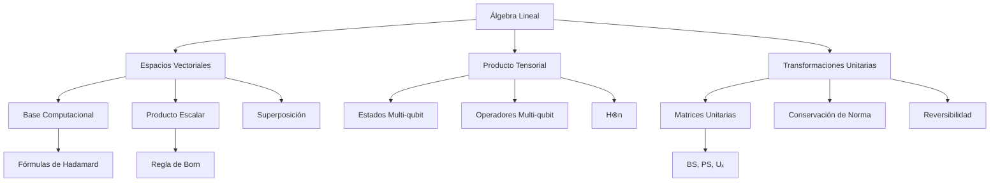
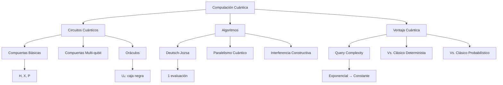

# Resumen Clase 6 - Interferómetro de Mach-Zehnder y Algoritmo de Deutsch-Jozsa

**Curso**: Introducción a la Computación Cuántica 2025  
**Docente**: Federico Holik (UNAHUR)  
**Fecha**: 28 de noviembre de 2025  
**Clase**: 6

---

## Resumen Ejecutivo

La clase se estructuró en dos partes principales: (1) análisis del interferómetro de Mach-Zehnder como introducción a la física cuántica experimental, con implementación en Qiskit, y (2) presentación del algoritmo de Deutsch-Jozsa como primer ejemplo de ventaja cuántica computacional. Se enfatizó el concepto de interferencia cuántica y se desarrolló el formalismo matemático necesario para algoritmos cuánticos.

---

## 1. Interferómetro de Mach-Zehnder

### 1.1 Configuración Experimental

El interferómetro consta de:
- **BS1 y BS2**: Divisores de haz (*beam splitters*) semirreflectantes (50% transmisión, 50% reflexión)
- **M1 y M2**: Espejos 100% reflectantes
- **PS**: Cambiador de fase (*phase shifter*)
- **D0 y D1**: Detectores de fotones

**Modos del sistema**:
- Modo 0: brazo inferior del interferómetro → $|0\rangle$
- Modo 1: brazo superior del interferómetro → $|1\rangle$

### 1.2 Descripción Cuántica

**Matrices de transformación**:

$$\text{BS} = \frac{1}{\sqrt{2}}\left[\begin{array}{cc}1 & i \\ i & 1\end{array}\right]$$

$$\text{PS}(\delta) = \left[\begin{array}{cc}1 & 0 \\ 0 & e^{i\delta}\end{array}\right]$$

**Evolución del estado** (con BS2):

1. Estado inicial: $|0\rangle$
2. Tras BS1: $|\psi_1\rangle = \frac{1}{\sqrt{2}}(|0\rangle + i|1\rangle)$
3. Tras PS: $|\psi_2\rangle = \frac{1}{\sqrt{2}}(|0\rangle + ie^{i\delta}|1\rangle)$
4. Tras BS2: $|\psi_3\rangle$ con probabilidades que dependen de $\delta$

**Probabilidades de detección**:

$$P(|0\rangle) = \sin^2(\delta/2)$$

$$P(|1\rangle) = \cos^2(\delta/2)$$

**Resultado clave**: La probabilidad de detección oscila con la fase $\delta$, demostrando **interferencia cuántica**.

### 1.3 Implementación en Qiskit

```python
from qiskit import QuantumCircuit
import numpy as np

# Definir matrices
BS = (1/np.sqrt(2)) * np.array([[1, 1j], [1j, 1]])
PS = lambda delta: np.array([[1, 0], [0, np.exp(1j*delta)]])

# Crear circuito
mz = QuantumCircuit(1)
mz.unitary(BS, 0, label='BS1')
mz.p(delta, 0)  # Phase gate
mz.unitary(BS, 0, label='BS2')
```

---

## 2. Repaso Matemático para Algoritmos Cuánticos

### 2.1 Base Computacional y Producto Tensorial

Para n qubits:
- Base computacional: $\{|x\rangle : x \in \{0,1\}^n\}$
- Dimensión del espacio: $2^n$
- Producto tensorial: $|x_1x_2...x_n\rangle = |x_1\rangle \otimes |x_2\rangle \otimes ... \otimes |x_n\rangle$

**Producto escalar**:

$$\langle x|y \rangle = \begin{cases}1 & \text{si } x = y \\ 0 & \text{si } x \neq y\end{cases}$$

### 2.2 Compuerta Hadamard Multi-qubit

**Acción de $H^{\otimes n}$ sobre $|0\rangle^{\otimes n}$**:

$$H^{\otimes n}|0\rangle^{\otimes n} = \frac{1}{\sqrt{2^n}}\sum_{x \in \{0,1\}^n}|x\rangle$$

Estado **equiprobable** sobre toda la base computacional.

**Acción de $H^{\otimes n}$ sobre $|y\rangle$**:

$$H^{\otimes n}|y\rangle = \frac{1}{\sqrt{2^n}}\sum_{x \in \{0,1\}^n}(-1)^{x \cdot y}|x\rangle$$

donde $x \cdot y$ es el producto escalar módulo 2.

### 2.3 Suma Módulo 2

$$\begin{align}
0 \oplus 0 &= 0 \\
0 \oplus 1 &= 1 \\
1 \oplus 0 &= 1 \\
1 \oplus 1 &= 0
\end{align}$$

### 2.4 Fases Globales vs. Fases Relativas

- **Fase global**: $|\psi'\rangle = e^{i\theta}|\psi\rangle$ → mismo estado físico
- **Fase relativa**: $(|0\rangle + e^{i\phi}|1\rangle)/\sqrt{2}$ → estado físico diferente para cada $\phi$

---

## 3. Algoritmo de Deutsch-Jozsa

### 3.1 Planteamiento del Problema

**Dada**: función $f: \{0,1\}^n \to \{0,1\}$  
**Premisa**: $f$ es **constante** (siempre 0 o siempre 1) **o balanceada** (mitad de las salidas 0, mitad 1)  
**Objetivo**: Determinar si $f$ es constante o balanceada con el menor número de evaluaciones

### 3.2 Solución Clásica

**Determinista**: 
- Peor caso: $2^{n-1} + 1$ evaluaciones
- Complejidad: **exponencial** en $n$

**Probabilística** (con probabilidad de error $\epsilon$):
- Realizar $c$ evaluaciones aleatorias
- Si todas coinciden → declarar "constante"
- Probabilidad de error: $P(\text{error}) \approx 1/2^c$ (si $f$ es balanceada)
- Complejidad: **constante** (independiente de $n$), pero con error

### 3.3 Solución Cuántica: Algoritmo de Deutsch-Jozsa

**Circuito cuántico**:

```
|0⟩^⊗n ─H^⊗n─┤     ├─H^⊗n─ Medición
             │ Uₓ │
|1⟩ ───H────┤     ├────────
```

**Pasos del algoritmo**:

1. **Inicialización**: $|0\rangle^{\otimes n}|1\rangle$

2. **Hadamard a todos los qubits**:

$$|\psi_1\rangle = \frac{1}{\sqrt{2^{n+1}}}\sum_{x}|x\rangle(|0\rangle - |1\rangle)$$

3. **Oráculo $U_f$**: $U_f|x\rangle|y\rangle = |x\rangle|y \oplus f(x)\rangle$

$$|\psi_2\rangle = \frac{1}{\sqrt{2^{n+1}}}\sum_{x}(-1)^{f(x)}|x\rangle(|0\rangle - |1\rangle)$$

4. **Hadamard a los primeros $n$ qubits**:

$$|\psi_3\rangle = \frac{1}{2^n}\sum_{x,y}(-1)^{f(x) + x \cdot y}|y\rangle \otimes (|0\rangle - |1\rangle)$$

5. **Medición** de los primeros $n$ qubits

**Resultado**:
- Si $f$ es **constante**: $P(|0\rangle^{\otimes n}) = 1$ → medición siempre da $00...0$
- Si $f$ es **balanceada**: $P(|0\rangle^{\otimes n}) = 0$ → medición nunca da $00...0$

**Complejidad oracular**: **1 evaluación** (vs. exponencial clásico determinista)

### 3.4 Análisis Matemático

**Coeficiente de $|0\rangle^{\otimes n}$ en $|\psi_3\rangle$**:

$$c_{0^n} = \frac{1}{2^n}\sum_{x \in \{0,1\}^n}(-1)^{f(x)}$$

- **Si $f$ constante** ($f(x) = c$ para todo $x$):

$$c_{0^n} = \frac{1}{2^n} \cdot 2^n \cdot (-1)^c = \pm 1$$
  
- **Si $f$ balanceada**:

$$c_{0^n} = \frac{1}{2^n}\left(\sum_{f(x)=0}1 - \sum_{f(x)=1}1\right) = 0$$

### 3.5 Limitaciones del Algoritmo

El algoritmo de Deutsch-Jozsa **no ofrece ventaja práctica** porque:
1. El algoritmo clásico probabilístico tiene complejidad constante
2. Con $c = 10$ evaluaciones aleatorias: $P(\text{error}) \approx 1/1024 \approx 0.1\%$
3. Es un problema "de juguete" sin aplicaciones reales

**Valor pedagógico**: Ilustra el concepto de **ventaja cuántica** mediante interferencia y paralelismo cuántico.

---

## Mindmaps

### Álgebra Lineal



### Física Cuántica

```mermaid
graph TB
    A[Física Cuántica] --> B[Naturaleza de la Luz]
    A --> C[Interferencia]
    A --> D[Medición Cuántica]
    
    B --> B1[Fotones]
    B --> B2[Dualidad Onda-Partícula]
    B --> B3[Estados Cuánticos del Campo EM]
    
    C --> C1[Divisores de Haz]
    C --> C2[Diferencia de Fase]
    C --> C3[Patrón de Interferencia]
    C --> C4[Constructiva/Destructiva]
    
    D --> D1[Regla de Born]
    D --> D2[Colapso del Estado]
    D --> D3[Probabilidades de Medición]
    
    C1 --> E[Mach-Zehnder]
    C2 --> E
    C3 --> E
    D1 --> F[P = |⟨ψ|φ⟩|²]
```

### Computación Cuántica



---

## Referencias Bibliográficas

### Principales

1. **Nielsen, M. A., & Chuang, I. L.** (2000). *Quantum Computation and Quantum Information*. Cambridge University Press.
   - Secciones relevantes: Deutsch-Jozsa algorithm, Quantum oracles, Phase kickback

2. **Kitaev, A. Y., Shen, A. H., & Vyalyi, M. N.** (2002). *Classical and Quantum Computation*. Graduate Studies in Mathematics 47, American Mathematical Society.
   - Secciones relevantes: Query complexity, Oracle separation

3. **Kaye, P., Laflamme, R., & Mosca, M.** (2007). *An Introduction to Quantum Computing*. Oxford University Press.
   - Secciones relevantes: Deutsch problem, Hadamard transform

4. **Wong, T. G.** (2022). *Introduction to Classical and Quantum Computing*. Rooted Grove.
   - Secciones relevantes: Interferencia cuántica, Primeros algoritmos

### Recursos de IBM Quantum

- **IBM Quantum Learning**: [Basics of Quantum Information](https://quantum.cloud.ibm.com/learning/en/courses/basics-of-quantum-information)
  - Módulos relevantes: Single-qubit gates, Multi-qubit gates, Quantum algorithms

### Material del Curso

- **Holik, F.** (2025). *Curso de Introducción a la Computación Cuántica - UNAHUR*.
  - Clase 6: Interferómetro de Mach-Zehnder y Algoritmo de Deutsch-Jozsa
  - Notebooks Jupyter con implementaciones en Qiskit

---

## Referencias Cruzadas a Clases Previas

### [[ICC25-Holik-Clase1-Resumen]]
- **Conceptos utilizados**: 
  - Notación de Dirac
  - Estados cuánticos básicos $|0\rangle$ y $|1\rangle$
  - Superposición cuántica
  - Medición y colapso del estado

### [[ICC25-Holik-Clase2-Resumen]]
- **Conceptos utilizados**:
  - Compuerta Hadamard $H$
  - Representación matricial de compuertas
  - Producto tensorial de estados
  - Bases ortonormales

### [[ICC25-Holik-Clase3-Resumen]]
- **Conceptos utilizados**:
  - Espacios de Hilbert de dimensión finita
  - Producto interno complejo
  - Transformaciones unitarias
  - Regla de Born para probabilidades

### [[ICC25-Holik-Clase4-Resumen]]
- **Conceptos utilizados**:
  - Circuitos cuánticos multi-qubit
  - Evolución temporal de estados cuánticos
  - Implementación de compuertas en Qiskit
  - Simulación de sistemas cuánticos

### [[ICC25-Holik-Clase5-Resumen]]
- **Conceptos utilizados**:
  - Compuertas de fase (Phase gates)
  - Manipulación de fases relativas
  - Interferencia cuántica
  - Oráculos cuánticos (introducción)

---

## Notas Metodológicas

### Ejercicios Propuestos

1. **Interferómetro de Mach-Zehnder**:
   - Verificar todas las cuentas matriciales desde $|0\rangle$ hasta $|\psi_3\rangle$
   - Implementar en Qiskit y graficar $P(D_0)$ y $P(D_1)$ vs. $\delta$
   - Analizar el caso sin BS2 y verificar independencia de fase

2. **Hadamard Multi-qubit**:
   - Probar $H^{\otimes 2}|01\rangle$ y $H^{\otimes 3}|101\rangle$ paso a paso
   - Verificar la fórmula general con $(-1)^{x \cdot y}$
   - Implementar en Qiskit y medir todas las probabilidades

3. **Deutsch-Jozsa**:
   - Caso $n=1$: verificar las 4 funciones posibles manualmente
   - Caso $n=2$: implementar circuito para $f$ balanceada específica
   - Comparar número de consultas: clásico vs. cuántico

### Conceptos Clave para Retener

1. **Interferencia cuántica** ≠ superposición simple
2. **Fases globales** son físicamente irrelevantes
3. **Fases relativas** determinan patrones de interferencia
4. **Paralelismo cuántico**: evaluar $f$ en todos los inputs simultáneamente
5. **Separación oracular**: ventaja en query complexity, no necesariamente práctica

### Advertencias Pedagógicas

- Deutsch-Jozsa es un algoritmo "de juguete"
- La ventaja cuántica desaparece si se permite error probabilístico
- Importancia: ilustra principios, no aplicaciones directas
- El valor está en la técnica: oráculo → interferencia → amplificación de amplitudes

---

## Anexo: Código Completo en Qiskit

```python
import numpy as np
from qiskit import QuantumCircuit, transpile
from qiskit_aer import AerSimulator

# ===== INTERFERÓMETRO DE MACH-ZEHNDER =====

def mach_zehnder(delta, with_bs2=True):
    """
    Implementa el interferómetro de Mach-Zehnder
    
    Args:
        delta: fase del phase shifter
        with_bs2: incluir segundo beam splitter
    """
    # Definir matrices
    BS = (1/np.sqrt(2)) * np.array([[1, 1j], [1j, 1]])
    
    # Crear circuito
    qc = QuantumCircuit(1, 1)
    
    # BS1
    qc.unitary(BS, 0, label='BS1')
    
    # Phase shifter
    qc.p(delta, 0)
    
    # BS2 (opcional)
    if with_bs2:
        qc.unitary(BS, 0, label='BS2')
    
    # Medición
    qc.measure(0, 0)
    
    return qc

# Ejecutar con diferentes fases
simulator = AerSimulator()
for delta in [0, np.pi/4, np.pi/2, np.pi]:
    qc = mach_zehnder(delta, with_bs2=True)
    compiled = transpile(qc, simulator)
    result = simulator.run(compiled, shots=1000).result()
    counts = result.get_counts()
    print(f"δ = {delta:.2f}: {counts}")

# ===== ALGORITMO DE DEUTSCH-JOZSA =====

def deutsch_jozsa_oracle(n, oracle_type='constant_0'):
    """
    Crea el oráculo Uₓ para Deutsch-Jozsa
    
    Args:
        n: número de qubits de entrada
        oracle_type: 'constant_0', 'constant_1', 'balanced'
    """
    qc = QuantumCircuit(n+1)
    
    if oracle_type == 'constant_0':
        # No hacer nada: f(x) = 0 para todo x
        pass
    
    elif oracle_type == 'constant_1':
        # Flip último qubit: f(x) = 1 para todo x
        qc.x(n)
    
    elif oracle_type == 'balanced':
        # Ejemplo: f(x) = x₀ (primer bit)
        qc.cx(0, n)
    
    return qc

def deutsch_jozsa(n, oracle):
    """
    Implementa el algoritmo de Deutsch-Jozsa
    
    Args:
        n: número de qubits
        oracle: circuito del oráculo
    """
    qc = QuantumCircuit(n+1, n)
    
    # Inicialización
    qc.x(n)  # Último qubit a |1⟩
    
    # Hadamard a todos
    for i in range(n+1):
        qc.h(i)
    
    # Aplicar oráculo
    qc.compose(oracle, inplace=True)
    
    # Hadamard a primeros n qubits
    for i in range(n):
        qc.h(i)
    
    # Medición de primeros n qubits
    qc.measure(range(n), range(n))
    
    return qc

# Ejemplo: n=2
n = 2
oracle_balanced = deutsch_jozsa_oracle(n, 'balanced')
qc = deutsch_jozsa(n, oracle_balanced)

# Ejecutar
compiled = transpile(qc, simulator)
result = simulator.run(compiled, shots=1000).result()
counts = result.get_counts()

print(f"\nResultados Deutsch-Jozsa (n={n}, balanceada):")
print(counts)
if '00' not in counts or counts.get('00', 0) == 0:
    print("Conclusión: f es BALANCEADA")
else:
    print("Conclusión: f es CONSTANTE")
```

---

**Fecha de creación**: 28 de noviembre de 2025  
**Versión**: 1.1 (LaTeX corregido para Obsidian)
