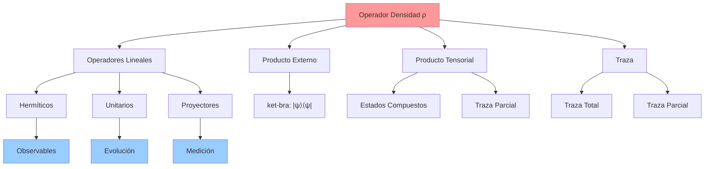
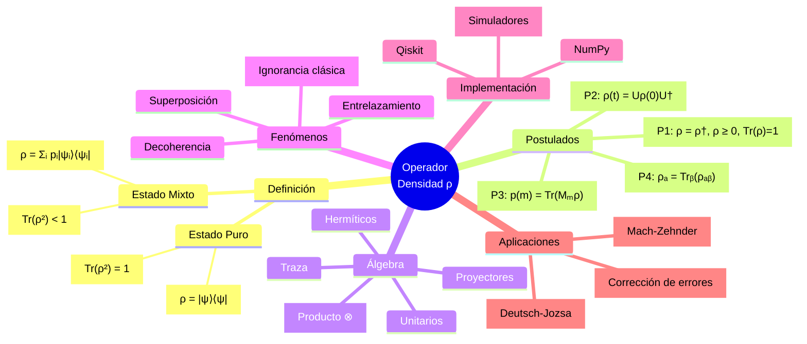

---
aliases:
  - matriz densidad
  - rho
---

# El Operador Densidad como Marco Unificador en Computación Cuántica

**Fecha de creación:** 2024-12-24  
**Propósito:** Nota síntesis que integra todos los conceptos del vault relacionados con el formalismo de matriz densidad como lenguaje unificador de la mecánica cuántica aplicada a QC.

---

## Tesis Central

**§1 [PARAPHRASE from Fisica.md]** El operador densidad $\rho$ constituye el formalismo matemático más general para describir estados cuánticos, unificando estados puros y mixtos bajo un único marco conceptual. Esta generalidad le otorga poder expresivo suficiente para capturar **toda** la mecánica cuántica aplicada en computación cuántica.

**§2 [INFERRED]** Tu hipótesis es correcta: el operador densidad puede servir como "mapa completo" del vault (excluyendo aspectos puramente de programación). Veamos por qué:

---

## Jerarquía Conceptual: De Vectores de Estado al Operador Densidad

### Nivel 1: Estados Puros (Vectores de Estado)

**§3** Ver: [[Fisica#Postulado 1 Espacio de Estados]]

**Definición básica:**
$$|\psi\rangle \in \mathcal{H}, \quad \langle\psi|\psi\rangle = 1$$

**Limitaciones del formalismo de vectores:**
1. Solo describe sistemas con **máximo conocimiento cuántico**
2. No puede representar ignorancia clásica
3. No permite describir subsistemas de sistemas entrelazados

**§3.1 [ELABORATION] ¿Qué significa "máximo conocimiento cuántico"?**

Un estado puro $|\psi\rangle$ representa el **máximo conocimiento posible** sobre un sistema cuántico:
- **Entropía mínima:** $S(|\psi\rangle\langle\psi|) = 0$
- **Conocimiento completo del estado:** no hay ignorancia sobre cuál es el estado
- **Pero aún hay incertidumbre:** mediciones de observables no compatibles son probabilísticas, ver [[Fisica#Principio de Incertidumbre|Principio de Incertidumbre de Heisenberg]]

**Ejemplo - Spin-1/2:** Si preparamos $|\psi\rangle = |+\rangle_z$ (autovector de $S_z$):
- Medir $S_z$: resultado siempre $+\hbar/2$ (determinístico)
- Medir $S_x$: resultado $\pm\hbar/2$ con probabilidad 1/2 cada uno (probabilístico)

Esta incertidumbre **NO es ignorancia** sobre el estado - es **intríseca** a la mecánica cuántica (principio de Heisenberg). Tenemos conocimiento máximo del estado, pero las mediciones siguen siendo probabilísticas para observables no compatibles.

**§3.2 [ELABORATION] ¿Qué es "ignorancia clásica"?**

Un estado mixto $\rho = \sum_i p_i |\psi_i\rangle\langle\psi_i|$ representa:
1. **Incertidumbre cuántica** (presente en cada $|\psi_i\rangle$)
2. **PLUS** ignorancia clásica: no sabemos cuál $|\psi_i\rangle$ describe el sistema

**Ejemplo:** Sistema preparado con:
- Probabilidad 0.7 en $|0\rangle$
- Probabilidad 0.3 en $|1\rangle$

$$\rho = 0.7|0\rangle\langle 0| + 0.3|1\rangle\langle 1| = \begin{pmatrix} 0.7 & 0 \\ 0 & 0.3 \end{pmatrix}$$

Medir en base computacional:
- $p(0) = 0.7$ y $p(1) = 0.3$

Pero estas probabilidades tienen **origen diferente** a las del estado puro $|\psi\rangle = \sqrt{0.7}|0\rangle + \sqrt{0.3}|1\rangle$:
- Estado mixto: ignorancia clásica (no sabemos si está en $|0\rangle$ o $|1\rangle$)
- Estado puro: incertidumbre cuántica (sabemos que está en superposición)

**Distinción experimental:** Estados mixtos **no presentan interferencia** al medir en bases diferentes. Ver [[Fisica#Ejemplo 3 Comparación superposición vs mezcla]].

**Limitaciones del formalismo de vectores:**
1. Solo describe estados con **máximo conocimiento cuántico** (entropía cero)
2. No puede representar **ignorancia clásica** sobre la preparación
3. No permite describir **subsistemas** de sistemas entrelazados (requiere traza parcial)
### Nivel 2: Operador Densidad para Estados Puros

**§4** Ver: [[Fisica#Matriz Densidad (Operador Densidad)]]

**Transformación:**
$$|\psi\rangle \quad \longrightarrow \quad \rho = |\psi\rangle\langle\psi|$$

**Propiedades conservadas:**
- $\text{Tr}(\rho) = 1$
- $\rho = \rho^\dagger$ (hermiticidad)
- $\rho^2 = \rho$ (pureza: $\text{Tr}(\rho^2) = 1$)

**§5 [CRITICAL INSIGHT]** El paso de $|\psi\rangle$ a $\rho$ es **no invertible en general** (salvo por fase global), pero **equivalente operacionalmente**: ambas descripciones dan idénticas predicciones para cualquier observable.

### Nivel 3: Estados Mixtos

**§6** Ver: [[Fisica#Estados Puros y Estados Mixtos]]

**Generalización esencial:**
$$\rho = \sum_i p_i |\psi_i\rangle\langle\psi_i|$$

donde:
- $p_i \geq 0$: probabilidades clásicas
- $\sum_i p_i = 1$: normalización
- $|\psi_i\rangle$: estados puros (no necesariamente ortogonales)

**Distinción clave con superposición:**

| Concepto               | Representación                                               | Interferencia | Descripción                   |
| ---------------------- | ------------------------------------------------------------ | ------------- | ----------------------------- |
| **Superposición**      | $\|\psi\rangle = \alpha\|0\rangle + \beta\|1\rangle$         | SÍ            | Estado puro cuántico          |
| **Mezcla estadística** | $\rho = p_1\|0\rangle\langle 0\| + p_2\|1\rangle\langle 1\|$ | NO            | Estado mixto clásico-cuántico |

**§7** Ver ejemplo ilustrativo: ![[Fisica#Ejemplo 3 Comparación superposición vs mezcla]]

---

## Poder Expresivo: Cobertura Completa de la Mecánica Cuántica

### 1. Postulados Básicos Reformulados

**§8 [SYNTHESIS]** Todos los postulados se expresan naturalmente con $\rho$:

#### Postulado 1 (Estados)
**Original:** [[Fisica#Postulado 1 Espacio de Estados]]  
**Versión $\rho$:** El estado de un sistema es un operador $\rho$ con:
- $\rho = \rho^\dagger$
- $\rho \geq 0$ (semidefinido positivo)
- $\text{Tr}(\rho) = 1$

#### Postulado 2 (Evolución)
**Original:** [[Fisica#Postulado 2 Evolución Temporal]]  
**Versión $\rho$:** 
$$\rho(t) = U\rho(0)U^\dagger \tag{NC 2.120}$$
o en forma diferencial (ecuación de von Neumann):
$$i\hbar \frac{d\rho}{dt} = [H, \rho] \tag{NC 2.121}$$

**§9** Ver: [[Fisica#Evolución Temporal de $\rho$]]

#### Postulado 3 (Medición)
**Original:** [[Fisica#Postulado 3 Medición Cuántica]]  
**Versión $\rho$:**

Probabilidad de resultado $m$:
$$p(m) = \text{Tr}(M_m^\dagger M_m \rho) \tag{NC 2.117}$$

Estado post-medición:
$$\rho' = \frac{M_m \rho M_m^\dagger}{\text{Tr}(M_m^\dagger M_m \rho)} \tag{NC 2.119}$$

**§10** Ver: [[Fisica#Cálculo de Probabilidades y Valores Esperados]]

#### Postulado 4 (Sistemas Compuestos)
**Original:** [[Fisica#Postulado 4 Sistemas Compuestos]]  
**Versión $\rho$:**

Para sistemas A y B:
$$\rho_{AB} = \rho_A \otimes \rho_B \quad \text{(si no correlacionados)}$$

**Traza parcial** (reducción a subsistema):
$$\rho_A = \text{Tr}_B(\rho_{AB}) \tag{NC 2.122}$$

**§11 [CRITICAL]** Esta es una operación **imposible** con vectores de estado puros. Ver: [[Fisica#Traza Parcial Reducción a Subsistemas]]

---

### 2. Fenómenos Fundamentales Expresados con $\rho$

**§12** Tabla de mapeo fenómeno → formalismo:

| Fenómeno Físico | Expresión con $\|\psi\rangle$ | Expresión con $\rho$ | Ventaja de $\rho$ |
|---|---|---|---|
| **Superposición** | $\|\psi\rangle = \sum_i c_i\|i\rangle$ | $\rho = \|\psi\rangle\langle\psi\|$ (elementos off-diagonal $\neq 0$) | Coherencias visibles |
| **Entrelazamiento** | $\|\Psi\rangle_{AB} \neq \|\psi\rangle_A \otimes \|\phi\rangle_B$ | $\rho_A = \text{Tr}_B(\rho_{AB})$ es mixto | Describe subsistemas |
| **Decoherencia** | No expresable | $\rho(t)$ pierde elementos off-diagonal | Modelable naturalmente |
| **Ignorancia clásica** | No expresable | Ensamble: $\{(p_i, \|\psi_i\rangle)\}$ | Único formalismo válido |

**§13** Ver ejemplos numéricos: [[Fisica#Ejemplos Específicos]]

---

### 3. Álgebra Lineal Necesaria

**§14 [STRUCTURAL LINKS]** El operador densidad requiere y conecta los siguientes conceptos algebraicos:



**Enlaces directos:**
- [[Algebra#Operadores Lineales y Matrices]]
- [[Algebra#Producto Externo (Outer Product)]]
- [[Algebra#Producto Tensorial]]
- [[Algebra#Traza de una Matriz]]

**§15 [OVERLAP RESOLUTION]** En [[Algebra#Notación de Dirac]] se introduce $|\psi\rangle\langle\psi|$ como "proyector". En [[Fisica#Matriz Densidad (Operador Densidad)]] se generaliza a operador densidad. **No hay contradicción**: todo proyector en estado puro es un operador densidad con $\text{Tr}(\rho^2) = 1$.

---

### 4. Implementación Computacional

**§16** Ver: [[_Jupyter/SDKs-qiskit-pennylane#producto exterior]]

**Qiskit/NumPy:**
```python
# Construir ρ = |ψ⟩⟨ψ|
rho = np.outer(psi, psi.conj())

# Verificar propiedades
assert np.allclose(rho, rho.T.conj())  # Hermítica
assert np.isclose(np.trace(rho), 1.0)   # Normalizada
assert np.isclose(np.trace(rho @ rho), 1.0)  # Pura (si aplica)
```

**§17 [GAP]** Qiskit primitives (Sampler, Estimator) trabajan principalmente con **vectores de estado** por eficiencia computacional. Sin embargo:
- Para **sistemas abiertos** y **ruido**: se usa densidad
- Simulador: `AerSimulator(method='density_matrix')`
- Ver [[_Clases.d/ICC25-Holik-Clase5_srt#bracket density matrix]]

---

## Casos de Uso: Cuándo $\rho$ es Esencial

### 1. Subsistemas de Estados Entrelazados

**§18** Ver: [[Fisica#Ejemplo Estado de Bell]]

**Ejemplo paradigmático:**
$$|\Psi\rangle = \frac{1}{\sqrt{2}}(|00\rangle + |11\rangle)$$

Estado conjunto (puro):
$$\rho_{AB} = |\Psi\rangle\langle\Psi|$$

Subsistema A (mixto):
$$\rho_A = \text{Tr}_B(\rho_{AB}) = \frac{1}{2}(|0\rangle\langle 0| + |1\rangle\langle 1|) = \frac{I}{2}$$

**§19 [CRITICAL INSIGHT]** El estado de A **no puede** expresarse como $|\psi\rangle_A$. Este es el origen cuántico de mixtura por entrelazamiento.

### 2. Decoherencia y Ruido

**§20** Ver: [[Alexei Yu. Kitaev/Classical and Quantum Computation - Alexei Yu. Kitaev#11. Transformaciones físicamente realizables de matrices de densidad]]

**Evolución ruidosa:**
$$\rho \longrightarrow \mathcal{E}(\rho) = \sum_k E_k \rho E_k^\dagger$$

donde $\{E_k\}$ son operadores de Kraus.

**§21 [GAP from bibliography]** Nielsen & Chuang Cap. 8 cubre este tema extensamente. Kitaev et al. Cap. 11 lo trata formalmente. **Recomendación:** Revisar estos capítulos para completar este aspecto del mapa.

### 3. Ignorancia Sobre la Preparación

**§22** Ver: [[Fisica#Origen de estados mixtos]]

**Ejemplo:** Fuente cuántica que produce:
- $|0\rangle$ con probabilidad 0.7
- $|1\rangle$ con probabilidad 0.3

**Descripción:**
$$\rho = 0.7|0\rangle\langle 0| + 0.3|1\rangle\langle 1|$$

**§23** Esto es **fundamentalmente distinto** de:
$$|\psi\rangle = \sqrt{0.7}|0\rangle + \sqrt{0.3}|1\rangle$$

---

## Propiedades Distintivas del Formalismo

### Criterio de Pureza

**§24** Ver: [[Fisica#Criterio de Pureza]]

$$\begin{cases}
\text{Tr}(\rho^2) = 1 & \Leftrightarrow \text{estado puro} \\
\text{Tr}(\rho^2) < 1 & \Leftrightarrow \text{estado mixto}
\end{cases}$$

**§25 [INTERPRETATION]** La pureza $\gamma(\rho) = \text{Tr}(\rho^2)$ cuantifica qué tan "puro" es un estado:
- $\gamma = 1$: conocimiento cuántico máximo
- $\gamma = 1/d$ (donde $d = \dim \mathcal{H}$): estado maximalmente mixto (máxima ignorancia)

### Equivalencia Operacional

**§26** Cita de Nielsen & Chuang (page 101):
> "Two density operators are equal if and only if they give the same expectation values for all observables."

Ver: [[Fisica#Ventajas del Formalismo de Matriz Densidad]]

**§27 [INTERPRETATION]** Dos descripciones $\rho_1$ y $\rho_2$ son físicamente indistinguibles si:
$$\text{Tr}(M\rho_1) = \text{Tr}(M\rho_2) \quad \forall M \text{ (observable)}$$

---

## Overlaps y Contradicciones en el Vault

### Overlap 1: Proyectores vs Operadores Densidad

**Fuentes:**
- [[Algebra#Producto Externo (Outer Product)]]
- [[Fisica#Medición Proyectiva (caso especial)]]

**§28 [RESOLUTION]** 
- **Proyector:** $P = |\psi\rangle\langle\psi|$ con $P^2 = P$ y $P = P^\dagger$
- **Operador densidad (puro):** $\rho = |\psi\rangle\langle\psi|$ con $\rho^2 = \rho$ y $\rho = \rho^\dagger$

**Conclusión:** Son el mismo objeto matemático. La distinción es **contextual**:
- "Proyector" cuando usamos $P$ para medir/proyectar estados
- "Operador densidad" cuando $\rho$ representa el estado del sistema

### Overlap 2: Matriz de Densidad vs Vector de Estado

**Fuentes:**
- [[Fisica#Postulado 1 Espacio de Estados]]
- [[Fisica#Matriz Densidad (Operador Densidad)]]

**§29 [RESOLUTION]** Para estados puros:
$$|\psi\rangle \quad \longleftrightarrow \quad \rho = |\psi\rangle\langle\psi|$$

**Relación:**
- $|\psi\rangle$ tiene $2n$ parámetros reales (estado en $\mathbb{C}^{2^n}$, módulo normalización y fase global)
- $\rho$ tiene $2^{2n}$ elementos complejos, pero con restricciones (Hermitiana, normalizada, positiva semidefinida)

**Para estados puros:** Ambos formalismos son **equivalentes** (salvo fase global).  
**Para estados mixtos:** **Solo** $\rho$ es válido.

### Gap 1: Entropía de von Neumann

**§30 [IDENTIFIED GAP]** El vault menciona información cuántica pero no desarrolla:
$$S(\rho) = -\text{Tr}(\rho \log \rho) = -\sum_i \lambda_i \log \lambda_i$$

donde $\lambda_i$ son autovalores de $\rho$.

**Propiedades:**
- $S(\rho) = 0 \Leftrightarrow$ estado puro
- $S(\rho) = \log d \Leftrightarrow$ estado maximalmente mixto
- $S(\rho_A) \leq S(\rho_{AB})$ (subaditividad)

**§31 [RECOMMENDATION]** Crear nota sobre medidas de información cuántica (entropía, mutual information, discord, etc.) referenciando Nielsen & Chuang Cap. 11.

### Gap 2: Operaciones Cuánticas (Superoperadores)

**§32 [IDENTIFIED GAP]** Kitaev menciona "Superoperadores físicamente realizables" pero el vault no lo desarrolla.

**Conceptos faltantes:**
- Mapas completamente positivos
- Mapas que preservan traza
- Representación de Kraus
- Teorema de Choi-Jamiołkowski

**§33 [RECOMMENDATION]** Estudiar Kitaev Cap. 11 y Nielsen & Chuang Cap. 8.

---

## Conexiones con Clases y Conceptos del Vault

### Interferómetro de Mach-Zehnder

**§34** Ver: [[_Clases.d/ICC25-Holik-Clase6-Resumen#1. Interferómetro de Mach-Zehnder]]

**Conexión con $\rho$:**
- Sistema en estado puro: $\rho = |\psi\rangle\langle\psi|$
- Evolución: $\rho \to BS \cdot \rho \cdot BS^\dagger$
- Fase relativa determina **elementos off-diagonal** de $\rho$
- Interferencia visible en $\rho$ pero **no** en probabilidades diagonales solas

**§35** Ver discusión de fases: [[_Clases.d/ICC25-Holik-Clase6-Resumen#2.4 Fases Globales vs. Fases Relativas]]

### Deutsch-Jozsa

**§36** Ver: [[_Clases.d/ICC25-Holik-Clase6-Resumen#3. Algoritmo de Deutsch-Jozsa]]

**Análisis con $\rho$:**
- Estado inicial: $\rho_0 = |0\rangle^{\otimes n}\langle 0|^{\otimes n} \otimes |1\rangle\langle 1|$
- Post-Hadamard: superposición uniforme (elementos off-diagonal no nulos)
- Post-oráculo: **interferencia** codificada en coherencias de $\rho$
- Medición final: proyección que elimina coherencias

**§37 [INSIGHT]** El algoritmo **depende crucialmente** de mantener coherencias cuánticas (elementos off-diagonal de $\rho$). Si hubiera decoherencia prematura, el algoritmo fallaría.

---

## Tabla Resumen: Mapeo Completo

**§38** Integración sistemática vault ↔ operador densidad:

| Área del Vault | Concepto Clave | Expresión con $\rho$ | Nota de Referencia |
|---|---|---|---|
| **Álgebra** | Espacios de Hilbert | $\rho \in \mathcal{L}(\mathcal{H})$ | [[Algebra#Espacios de Hilbert]] |
| | Operadores Hermíticos | $\rho = \rho^\dagger$ | [[Algebra#Operadores Hermíticos]] |
| | Producto tensorial | $\rho_{AB} \in \mathcal{H}_A \otimes \mathcal{H}_B$ | [[Algebra#Producto Tensorial]] |
| | Autovalores | $\rho = \sum_i \lambda_i \|i\rangle\langle i\|$ | [[Algebra#Autovalores y Autovectores]] |
| **Física** | Estados puros | $\rho = \|\psi\rangle\langle\psi\|$ | [[Fisica#Estados Puros y Estados Mixtos]] |
| | Estados mixtos | $\rho = \sum_i p_i \|\psi_i\rangle\langle\psi_i\|$ | [[Fisica#Estados Mixtos]] |
| | Evolución | $\rho(t) = U\rho(0)U^\dagger$ | [[Fisica#Postulado 2 Evolución Temporal]] |
| | Medición | $p(m) = \text{Tr}(M_m \rho M_m^\dagger)$ | [[Fisica#Postulado 3 Medición Cuántica]] |
| | Entrelazamiento | $\rho_A = \text{Tr}_B(\rho_{AB})$ mixto | [[Fisica#Traza Parcial Reducción a Subsistemas]] |
| **Computación** | Qubits | $\rho \in \mathbb{C}^{2 \times 2}$ | [[Computacion#Qubit]] |
| | Compuertas | $\rho' = U\rho U^\dagger$ | [[Computacion#Compuertas Cuánticas]] |
| | Algoritmos | Coherencias en $\rho$ esenciales | [[_Clases.d/ICC25-Holik-Clase6-Resumen]] |
| **Implementación** | Qiskit/NumPy | `np.outer(psi, psi.conj())` | [[_Jupyter/SDKs-qiskit-pennylane]] |
| | Simulación | `AerSimulator(method='density_matrix')` | [[_Clases.d/ICC25-Holik-Clase5_srt]] |

---

## Conclusiones

**§39 [THESIS CONFIRMATION]** El operador densidad **efectivamente** tiene el poder expresivo para capturar toda la mecánica cuántica aplicada en computación cuántica:

1. **Generalidad:** Incluye estados puros (caso particular) y mixtos
2. **Completitud:** Todos los postulados se reformulan con $\rho$
3. **Fenómenos:** Expresa superosición, entrelazamiento, decoherencia, ignorancia
4. **Cálculos:** Simplifica muchas fórmulas (valores esperados, probabilidades)
5. **Subsistemas:** Única forma de describir partes de sistemas entrelazados

**§40 [VAULT MAP ASSESSMENT]** Este documento puede servir como "mapa" del vault porque:

- **Conecta Álgebra ↔ Física ↔ Computación** a través de $\rho$
- **Identifica overlaps** y los resuelve
- **Señala gaps** para estudio futuro
- **Organiza jerarquías** conceptuales
- **Provee enlaces directos** a notas relevantes

**§41 [LIMITATIONS]** Áreas NO cubiertas por este mapa (requieren extensión):
- Corrección de errores cuánticos
- Teoría de información cuántica (entropías, capacidades)
- Criptografía cuántica
- Aspectos de implementación física (hardware)
- Aspectos puramente de programación (sintaxis Qiskit, debugging, etc.)

---

## Referencias Bibliográficas Integradas

**§42** Textos clave organizados por profundidad:

### Nivel Introductorio
- [[Thomas G. Wong/Introduction to Classical and Quantum Computing - Thomas G. Wong|Wong]] - Caps sobre matriz densidad

### Nivel Intermedio  
- [[Michael A. Nielsen/Quantum Computation and Quantum Informatio - Michael A. Nielsen|Nielsen & Chuang]] - Sección 2.4 (págs. 98-112): tratamiento completo
- [[Phillip Kaye/An Introduction to Quantum Computing - Phillip Kaye|Kaye, Laflamme, Mosca]] - Perspectiva algorítmica

### Nivel Avanzado
- [[Alexei Yu. Kitaev/Classical and Quantum Computation - Alexei Yu. Kitaev|Kitaev et al.]] - Caps. 10-12: formalismo riguroso, superoperadores, teoría de medición

---

## Diagrama Conceptual Final

**§43** Mapa mental de relaciones:



---

**Versión:** 1.0  
**Última actualización:** 2024-12-24  
**Tags:** #operador-densidad #mapa-conceptual #sintesis #matriz-densidad
